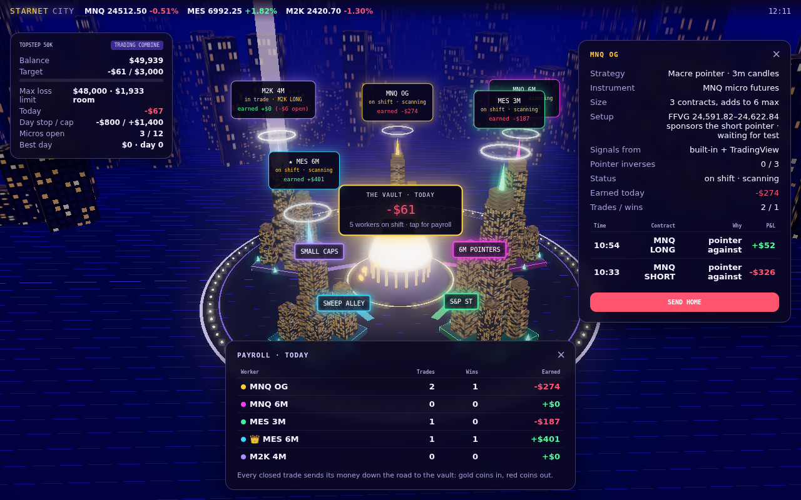
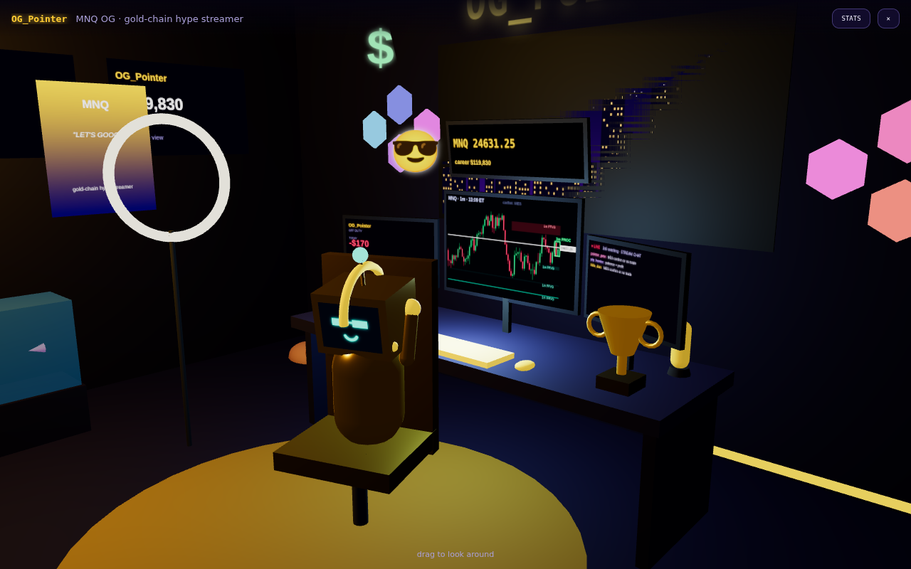

# Starnet City

A live 3D "trading city": each Python bot is a **worker** living in its own
building and trading micro futures (**MNQ, MES, M2K**) with the **Andrew Macre
pointer strategy**. All workers share **one prop firm account** whose rules
(Lucid Trading, LucidFlex 50K by default) they're built to pass: first the
evaluation, then the funded stage. They watch every session from the 18:00 ET
open to the 16:45 ET flat deadline and take new entries in the **London,
NY AM and NY PM killzones**, aiming for **$600–$1,200 a day**. When a worker is in a trade its
building fires a light beam into the sky. When it closes a trade, gold coins (or
red ones) roll down its road to **The Vault** in the middle of town.



## Streamer rooms

Tap any building to go inside: its bot is a little robot streamer at a desk,
with three monitors:

- **Chart**: its live 1m candles with the untapped FFVG/IFFVG zones it's
  watching, the current PROC box, its entry and the next-zone target.
- **P&L**: today, the open position, recent wins/losses, career earnings and
  progress to its next gadget.
- **Stream chat**: viewers reacting to every entry, add, win and loss.

Each bot has its own persona (handle, vibe, props and catchphrases in
`persona` in `config.py`) and shows how it feels: typing while it scans, a
"?" while it waits for MES to confirm, sweating in a losing trade, jumping with
arms up and coins flying on a win, hands on head under a rain cloud on a loss,
sunglasses when the day is locked in, slumped when the account stops it,
asleep when it's switched off. Its face is a little screen.

**The more a bot makes, the fancier its setup.** Gadgets unlock from its
best-ever lifetime earnings and are never taken back: RGB racing chair ($500),
4th monitor ($1k), hexagon LED wall ($2.5k), gold trophy + neon $ ($5k), wall
of screens ($10k), aquarium ($25k), gold-plated chassis ($50k), penthouse view
($100k). 💎 on a building's label shows how upgraded it is. In live mode,
lifetime earnings are saved in `data/paper_bots.json`.



## Run it

```bash
pip install -r requirements.txt
uvicorn backend.main:app --reload
# open http://localhost:8000
```

`STARNET_TICK_SECONDS=0.1 uvicorn backend.main:app` runs the market 10× faster.

- **Click a building** to open that worker's card: strategy, open position, recent trades, and a button to send it home or put it back on shift.
- **Click the vault** for today's payroll.

## How it's built

```
backend/
  market.py      simulated MNQ / MES / M2K prices with 1-minute OHLC candles
  broker.py      PaperBroker: micro futures (tick slippage + fees; options still supported). Implement open/close/mark to go live
  account.py     the shared prop firm account: LucidFlex / LucidPro 50K rules, EOD drawdown, daily goal / cap / stop, contract budget
  bots/base.py   the worker lifecycle: scanning → in_trade → off_duty / stopped / walked; 3 → 6 contract sizing
  bots/proc.py   the Macre PROC strategy (FFVG/IFFVG taps + 3-6m pointers)
  config.py      who lives in the city
  backtest.py    replay real 1m candles through the bots; walk-forward optimizer
  fetch_data.py  download free 1m NQ / ES / RTY futures history (Yahoo, ~30 days)
  live.py        live paper trading on real candles (Yahoo, or real-time via TradingView), with trade logs
  execution.py   real orders to your Lucid accounts via TradersPost (armed from the city, with safety checks)
  notify.py      phone notifications for every trade (web push to the home-screen app, or ntfy)
frontend/room.js  the bots' streamer rooms: robot, monitors, emotions, gadgets
Dockerfile, render.yaml   one-click hosting (password-protected) so you can watch from your phone
  engine.py      ticks the market and every bot, builds the snapshot
  main.py        FastAPI: WebSocket /ws, REST /api/state, /api/bots/{id}/{on|off}
frontend/
  city.js        Three.js scene: buildings, beams, halos, roads, coins, bloom, labels
```

### The strategy: PROC (`backend/bots/proc.py`)

A rebuild of the indicators on your TradingView chart (PROC – Pointer Range of
Control, Untapped FFVGs & IFFVGs, Troop Toolkit), computed from 1-minute candles:

1. **FFVG**: the first fair value gap after a confirmed swing high/low on any
   1–6 minute timeframe, within 6 candles of the swing (your "Sweep Proximity 6").
2. **Tap**: the first time any 1-minute wick trades into an untapped FFVG.
3. **IFFVG**: an FFVG that a candle on its own timeframe closes fully through
   flips into an opposite zone that can be tapped the same way.
4. **Pointer**: a 3/4/5/6-minute candle that closes inside the previous
   candle's wick (beyond the body, within the high/low).
5. **PROC = entry**: a pointer whose candle, or the one before it, made the
   first-ever wick into a same-direction untapped FFVG/IFFVG. The bot enters
   with 3 contracts and shows the next opposite zone as the expected move.
6. **Add**: another PROC the same way while the trade is in profit → +3 (6 max).
7. **Exit**: only on a PROC against the trade, i.e. a pointer against you on
   another FFVG/IFFVG. No stop loss.
8. **Walk away**: a PROC is invalidated when an opposite candle on its own
   timeframe closes beyond its box; 3 of those in a day and the bot stops.
9. **MNQ/MES correlation**: an MNQ PROC is only taken (or added to) when MES
   agrees within 6 minutes before or after it, and vice versa. `confirm_mode`
   sets how strict "agrees" is: `proc` (MES printed its own PROC the same way,
   the default), `pointer` (a same-way 3–6m pointer) or `tap` (a wick into a
   same-way FFVG/IFFVG). Exits never wait for confirmation. The bots keep both
   markets' structure up to date even if only one of them is being traded.

Settings (`params` in `config.py`, most tried by the optimizer): `confirm_with`,
`confirm_mode`, `confirm_window`, `pointer_tfs`,
`pivot_len`, `sweep_proximity`, `use_iffvg`, `walk_after`,
`exit_on_invalidation`, `killzones` (Asia 20:00–00:00, London 02:00–05:00,
NY AM 09:30–11:00, NY PM 14:00–16:00 ET), `require_liquidity_sweep` (the PROC
must take one of those sessions' highs/lows, like Troop's liquidity levels).

`backend/bots/pointer.py` is the earlier, simpler pointer bot, kept for reference.

### Position size

Every trade **starts at 3 contracts**. When another pointer forms in the trade's
direction and the trade is in profit, the bot **adds 3 more, up to 6, never
more**. The whole account holds at most **12 micros** at once (two bots at full
size), and only one bot can hold a given symbol at a time, so they never take
opposite sides of the same contract.

### Trading day and sessions

The simulated day matches the futures day under Lucid's flat rule: **18:00 ET
open → Asia → London (03:00) → New York (09:30) → flat by 16:45 ET**. Bots track
market structure the whole time but only open trades in the killzones London
02:00–05:00, NY AM 09:30–11:00 and NY PM 14:00–16:00 ET (open trades run on
until a PROC against them), and flatten at 16:40.

### Real-data results (Sep 8 – Oct 5 2026, 21 days of 1m NQ/ES/RTY)

| Settings | Profitable days | Total | Profit factor | Evaluations |
|---|---|---|---|---|
| **Defaults**: MNQ only (MES confirms), killzones London + NY AM + NY PM, pointer confirmation, swing length 6, stop after 3 losers in a row, $1,200 daily cap, −$600 daily stop | **71%** | **+$13,224** | **2.9** | 1 passed, 0 failed |
| Same with a −$800 daily stop | 76% | +$11,847 | 2.73 | 1 passed, 0 failed |
| Same with a $1,000 daily cap | 76% | +$10,173 | 2.63 | 1 passed, 0 failed |
| Same, with MES and M2K bots also trading | 71% | +$10,321 | 1.86 | 1 passed, 0 failed |
| Same, but entering in every session | 45% | −$515 | 0.97 | 0 passed, 2 failed |
| Original settings (all sessions, PROC confirmation, swing length 2) | 48% | −$127 | 0.97 | 1 passed, 2 failed |

On the last 7 days, which were never used for tuning, MNQ-only had 86%
profitable days and +$4,252. Win rate is ~48%: winners average ~2.9× losers
because trades only close on a PROC against them (or the daily cap).

What the trade-level breakdown showed, and what was tried:

- MNQ made +$9,645 while MES (−$197) and M2K (−$154) were breakeven → MNQ only.
- Trades that grew to 6 contracts made +$11,047; trades that stayed at 3 lost
  −$1,752. The edge is in adding to winners.
- Trades closed within 15 minutes lost (chop); trades held 60+ minutes won 72%.
- Losing days went straight to the −$800 stop without ever being up much →
  stop after 3 losing trades in a row.
- The daily cap does most of the profit-taking. $1,200 beat $1,000 (+16%, same
  consistency); $1,500 made more but fewer profitable days and a best day over
  Lucid's $1,500 consistency limit.
- Tested and rejected (worse when re-run): dropping 5m pointers, exiting only
  on an opposite PROC of the same or higher timeframe, a 2-loss streak stop,
  adding on MNQ's own pointers, an $800 goal or no goal, a profit lock that
  stops a green day from giving back (`lock_trigger` / `lock_floor`), 3 or 10
  minute confirmation windows, FFVGs only (IFFVGs carry a lot of the edge),
  and requiring a liquidity sweep (cut profit by ~90%).
- Robustness: with 2-3 ticks of slippage per side instead of 1 the results
  barely change, so the edge isn't living on perfect fills.
- Daily stops of −$600 and −$1,000 both beat −$800 on total profit, which
  shows how much of the difference between settings is noise on 21 days.
  Adding on an MES pointer (`add_on:
  "partner_pointer"`) made more money but fewer profitable days and a best day
  over $1,500: worth re-testing as more data comes in. 21 days is a small sample:
keep fetching data and re-running the backtest as history grows.

### Trims and the 5-minute chart (tested Oct 2026)

**Trims (partial profits).** Setting `params={"trim": True}` makes a bot close part of the
position each time price reaches the next untapped opposite FFVG/IFFVG in the
trade's direction. The last contract always runs until a pointer against, and
PROCs with the trade can add back up to 6. These settings tune it:

| Setting | What it does |
| --- | --- |
| `trim_frac` | Share of open contracts closed at each zone |
| `trim_min_tf` | Only zones of this timeframe or higher count |
| `trim_min_pts` | Only zones at least this many points from entry count |
| `trim_max` | Most trims per trade |
| `trim_fill` | `limit` at the zone edge, or `close` (market order after the candle) |

On real accounts each trim is sent to TradersPost as a `resize` to the remaining size.

On the 21 real days, **no trim setting made more money than no trims**:

| Setting | Total | Change |
| --- | --- | --- |
| No trims (default) | $13,224 | — |
| Best trim: 3m+ zones, 30+ pts away, 1/3 each | $12,899 | −$325 |
| Median of 36 trim settings | $11,886 | −$1,338 |
| Trim at every next zone | $6,896 | about half |

Every setting kept 71.4% green days. Trims shrink the size on the runners that
make the money (average win $540 vs average loss $181), and the daily $600 goal
and $1,200 cap already bank profits. So trims stay off by default.

**The 5-minute chart.** The **MNQ 5/6M** bot already trades 5m pointers (`pointer_tfs: [5, 6]`).
Results by entry timeframe:

| Entry | Trades | P&L | Win rate |
| --- | --- | --- | --- |
| 3m PROC | 25 | +$6,521 | |
| 4m PROC | 10 | +$2,322 | |
| 5m PROC | 16 | −$755 | 31% |
| 6m PROC | 18 | +$3,950 | |

Removing 5m entries still made less overall ($11,362). Other ways of using the 5m, tested:

| Setup | Total |
| --- | --- |
| Current: [3,4] + [5,6] | $13,224 |
| Dedicated 5m bot | $12,474 |
| 5m only | $3,417 |
| 5m PROC/pointer as a direction filter (`bias_tf: 5`) | $17 – $4,119 |

So the current setup stays.

### Daily goal

| | Default | What happens |
|---|---|---|
| Daily goal | **$600** closed profit | no new trades; open trades keep running until a pointer forms against them |
| Daily cap | **$1,200** open + closed | flatten everything, done for the day |
| Daily stop | **−$600** open + closed | flatten everything, done for the day (smaller when the account is near its drawdown) |

### Prop firm account (`backend/account.py`)

All bots trade one shared account with LucidFlex 50K rules:

| Rule | LucidFlex 50K | What the bots do |
|---|---|---|
| Profit target | $3,000, at least 2 trading days | stop for the day once it's in hand; pass at the 16:45 close |
| Drawdown | **End-of-day**: $2,000 below the highest *closing* balance, only moves at the close, locks at $50,100 once the account closes at $52,100 | never let a day's loss reach it (keep a $100 cushion). Equity touching it during the day is treated as a breach (the safe reading) |
| Consistency | evaluation: best day ≤ 50% of profit; funded: none | the $1,200 cap keeps the best day under half the $3,000 target |
| Daily loss limit | none | our own −$600 daily stop |
| Max size | 40 micros | at most 12 micros open, 3–6 per trade |
| Flat rule | flat by 16:45 ET, no overnight/weekend holds | flatten at 16:40 |

`LUCIDPRO_50K` is also included (no evaluation consistency rule; 40% funded
consistency and a $2,100 payout buffer). Use it with
`PropAccount(rules=LUCIDPRO_50K)` in `engine.py`. After passing, the account
switches to the funded stage and the panel shows when a payout is eligible. If
it fails, or ends up with under $150 of room above the drawdown, the bots stop
and the panel shows **Reset evaluation**. Change `Guards` in `account.py` to
adjust the goal, cap, stop or contract budget.

The account's limits are the only exits besides a pointer against the trade:
there are still **no per-trade stops**.

| Bot rule | Effect |
|---|---|
| End of day | flattens everything 5 minutes before the close |
| Walk away | 3 pointer inverses in a day and that bot stops for the day |

### Add a worker

```python
# backend/config.py
(ProcBot, BotConfig(id="mes-ny", name="MES NY", underlying="MES", district="LAB", timeframe=5,
                    params={"pointer_tfs": [5], "killzones": ["NY AM"]}, color="#ff00aa")),
```

To add another micro (e.g. MYM), add it to `Market.underlyings` and its dollars
per point to `FUTURES_MULTIPLIER` in `broker.py` (MNQ $2, MES $5, M2K $5, MYM $0.50).

The city lays itself out automatically for however many workers you register.

## Live paper trading (`backend/live.py`)

Run the city on real markets with paper money:

```bash
STARNET_MODE=live uvicorn backend.main:app
```

- Real MNQ / MES / M2K candles (via NQ=F / ES=F / RTY=F on Yahoo) step the
  bots minute by minute. The header shows **● LIVE PAPER** and how far behind
  the data is: Yahoo's free CME feed is **~10 minutes delayed**, so this is a
  forward test, not something to mirror trades from.
- On startup the bots read the last 2 days of candles without trading, so
  their FFVG / PROC structure is ready before the first live candle.
- Every closed trade goes to `data/paper_trades.csv`, every finished day to
  `data/paper_days.csv`, and the prop account to `data/paper_account.json`, so
  a restart resumes the same evaluation (open positions aren't carried over).
- Leave it running on a small server or always-on computer for a few weeks:
  forward-test results can't be overfit, unlike backtests.

Going from paper to a real Lucid account needs a real-time data feed and order
routing through the platform your account uses (see *Going live* below).

## News filter (`backend/news.py`)

These bots trade without a stop loss, so a CPI, FOMC or NFP candle is the
quickest way to lose a prop account. For every high-impact USD release on the
ForexFactory calendar:

- **No new trades** from 10 minutes before the release until 15 minutes after it, or 45 minutes after for FOMC.
- **Open trades are closed** 2 minutes before the release.

The account panel lists the next releases, the activity feed shows each pause,
and your phone gets an alert. The calendar refreshes every 6 hours and is saved
to `data/news_calendar.json`. Add your own events in `data/news_extra.json`.

Settings (environment variables):

| Variable | Default | What it does |
| --- | --- | --- |
| `STARNET_NEWS_BEFORE` | 10 | Minutes before a release with no new trades |
| `STARNET_NEWS_AFTER` | 15 | Minutes after a release with no new trades |
| `STARNET_NEWS_AFTER_FOMC` | 45 | Minutes after an FOMC release with no new trades |
| `STARNET_NEWS_FLATTEN` | 2 | Minutes before a release to close open trades; `0` holds them instead |

To backtest with a calendar: `--news data/news_calendar.json`.

## Trading desk: journals, news and a daily plan (`backend/desk.py`)

The bots hold two meetings a day on Claude (`claude-opus-5-5`):

- **🌙 Evening meeting**, after each day's report:
  - Every bot writes a journal entry in its own voice about its actual trades (why in, why out, what it learned).
  - The desk updates its **standing lessons**, which are fed back into every later meeting. That's how they learn.
  - The desk sets the risk mode for the overnight and London session.
- **☀️ Morning briefing**, 08:40 ET on weekdays:
  - A web search for what is moving NQ/ES today (the 8:30 data, Fed, megacap news, geopolitics).
  - A plan, a one-line note for each bot, and the risk mode for New York.

The desk is built to compete and never quit, and to treat discipline as the weapon.
**It can only take risk off**:

- `normal`: trade as usual (the default)
- `cautious`: no adds, positions stay at 3 contracts
- `sit_out`: no new trades until the next meeting

It can't touch the strategy, the stops, or the goal and cap. The replay check trades
every day in normal mode, so each non-normal mode's cost or savings is measured, and
the desk sees that history. You can make the desk advisory-only from its panel.

**Turn it on:** add `ANTHROPIC_API_KEY` in Render → Environment. Without a key the desk
stays off and nothing else changes. Expect about 4 Claude calls and up to 10 web
searches a day: roughly $0.30–0.70 a day, or $10–20 a month.

**Where to see it:**

- 🧠 Desk notes in the account panel: briefings, meetings, lessons, and "hold a meeting now"
- **JOURNAL** in each bot's room
- The desk section of each daily report
- A push after each meeting

Everything is saved in `data/desk/`.

## Candle history (`backend/history.py`)

Yahoo only keeps about 30 days of 1-minute candles, so live mode saves them as they come in:

- **On startup:** it backfills the last 29 days.
- **At every day roll:** it saves the newest days again.

Everything goes to `data/history/{MNQ,MES,M2K}_1m.csv` on the Render disk. The
account panel shows how many days are saved, with download links (also at
`/api/history/MNQ.csv`). Feed the files to the backtester to re-test and
re-optimize on more data as it builds up:

    python -m backend.backtest MNQ_1m.csv MES_1m.csv M2K_1m.csv --optimize

## Paper vs backtest check (`backend/scorecard.py`)

When each trading day ends, live mode downloads that day's candles again and
replays them through the same bots, settings and account state. It then checks
that paper trading took the same trades. A mismatch means the live pipeline
changed the result (late or missing candles, a restart, a bot switched on or
off), so backtest numbers won't carry over to real money yet.

The account panel also compares the paper days so far with the backtest: green
days, average day and profit factor. After each day you get a push such as
"📊 Day done +$640 · replay +$640 ✅". The full history is at `/api/scorecard`
and in `data/paper_checks.json`.

Before you connect real money, look for:

- **Replay match:** close to 100% on days without a restart.
- **Green days and average day:** near the backtest after 15–20 days.

## Daily report (`backend/report.py`)

When each trading day ends (around 6pm ET in live mode), the app saves a report
of the day. Once the paper-vs-backtest replay has checked the day, it pushes a
summary to your phone, for example:

> 📊 Tue Oct 6 · +$640 · 3 trades
> 2W 1L · goal ✓
> Eval +$1,840 / $3,000 (61%) · $2,450 room
> Replay ✅ 3/3 trades matched
> Best: OG_Pointer +$520 (3m PROC + MES)

Tap the push, or 📒 Daily reports in the account panel, to see each trade's
entry reason, adds, exit reason and prices. The panel also shows news pauses and
daily stops. Reports are saved in `data/reports/` and served at `/api/reports`.
For ntfy, set `STARNET_PUBLIC_URL` (Render sets `RENDER_EXTERNAL_URL` for you)
so that tapping the notification opens the report.

## Full-screen chart

In any bot's room, tap **CHART** to open a full-screen chart of what the bot sees:

- 1m, 3m, 6m or 15m candles, aligned to the clock
- The untapped FFVG and IFFVG zones (✓ marks a zone that has been tapped)
- The live PROC box
- Every pointer (small arrow) and PROC (big arrow) on the bot's timeframes
- The MES pointers that confirm entries, in the strip at the bottom
- Today's entries (yellow arrow), exits (✕ with P&L) and the open position with live P&L

Drag to scroll back, pinch or scroll to zoom, and double-tap to return to now.
The chart refreshes every 3 seconds.

## Watch it from your phone, 24/7 (deploy to Render)

The repo is ready to host: `Dockerfile` + `render.yaml` run the city in live
paper mode with a password and a disk for the paper-trading logs.

1. **Merge PR #1** into `main` on GitHub (Render deploys the default branch).
2. Sign up at **render.com** with your GitHub account.
3. Dashboard → **New → Blueprint** → pick `levetteit/starnet` → **Apply**.
4. When asked for **`STARNET_PASSWORD`**, pick a strong password. That's what
   you'll type on your phone. (`STARNET_WEBHOOK_SECRET` is generated for you.)
5. It uses the **Starter plan (~$7/month) + a 1 GB disk (~$0.25/month)**. The free
   plan sleeps after 15 minutes without visitors, which would stop the bots.
6. When the deploy is green, open the `https://starnet-city-….onrender.com` URL
   on your phone, log in with any username + your password, then
   **Share → Add to Home Screen** (iPhone) or **⋮ → Add to Home screen /
   Install app** (Android). It opens full screen like an app.

On the phone you get a compact account bar (tap it for the full panel), the
city, and an **activity feed** of what every bot is doing: PROCs seen, waiting
for MES, entries, adds, exits, account stops. Tap a building for its card.

Every push to `main` redeploys automatically. Paper results stay on the disk
(`/app/data/paper_trades.csv`, `paper_days.csv`); download them from Render's
Shell tab. The same Docker image runs on Fly.io, Railway or any VPS: set
`STARNET_PASSWORD`, mount a volume at `/app/data`, expose port 8000.

## Trade alerts on your phone (`backend/notify.py`)

Get a notification every time a bot enters, adds to or exits a trade (with the
P&L), when the account stops for the day, and if a real order ever fails.

**iPhone / Android (no extra app):** open Starnet from its **home-screen icon**
(on iPhone, web push only works from there), tap the account bar to expand it →
**🔔 TURN ON ALERTS** → **Allow**. You'll get a confirmation buzz; **SEND TEST**
sends another. Turn it on separately on each device you want alerts on.

**Backup: ntfy.** Install the free **ntfy** app, subscribe to a long random topic
name (e.g. `starnet-7f3k9q2x`), and set `STARNET_NTFY_TOPIC` to the same name in
Render → Environment.

Alerts only fire in live mode. Real-order alerts are marked **· REAL**.

## Real orders on your Lucid accounts (`backend/execution.py`)

Lucid allows automated trading (not high-frequency trading or sub-5-second
scalping, which these bots don't do). Real orders go **bot → TradersPost →
Tradovate → your Lucid account(s)**. Two pieces, both one-time setup:

**1. Real-time prices (required).** The free Yahoo data is ~10 minutes late, and
real orders are blocked whenever prices are more than 2.5 minutes old. The
`tradingview/starnet_feed.pine` script streams each 1-minute candle the moment
it closes (needs a paid TradingView plan with webhooks and CME real-time data):

1. In Render → your service → **Environment**, copy `STARNET_FEED_SECRET`.
2. TradingView → open **MNQ1!** on the **1-minute** chart → Pine Editor → paste
   the script → **Add to chart** → settings → paste the secret.
3. **Create Alert** → Condition **Starnet feed → Any alert() function call** →
   Notifications: **Webhook URL** `https://<your-render-url>/api/feed` → Create.
4. Repeat 2–3 on **MES1!** (MES confirms every MNQ entry).

The account panel shows **Price data: TradingView · real-time** once it's flowing.

**2. Order routing.**

1. Buy your Lucid account(s) and choose **Tradovate** as the platform.
2. Sign up at **traderspost.io** → **Brokers → Tradovate** → log in with your
   Lucid Tradovate credentials (repeat for each Lucid account).
3. **Strategies → New strategy** (futures). Copy its **webhook URL**.
4. **Subscribe** each Lucid account to the strategy. In the subscription
   settings: allow **shorting**, allow **add to position**, use the **signal's
   quantity**, market orders. No stop loss or take profit (the bots manage exits).
5. Render → **Environment** → set `STARNET_TRADERSPOST_WEBHOOKS` to that URL →
   Save (it redeploys).
6. In the city, the account panel shows **Real orders: off**. Tap
   **ARM REAL ORDERS** and type `ARM`. The header turns to **● REAL ORDERS**.

What gets sent: entry `buy`/`sell` with the bot's quantity (3), `add` (3 more,
6 max) and `exit`, on the front-month contract (e.g. `MNQZ2026`, rolling 8
days before expiry). Every order is logged in `data/orders.csv`.

Safety built in:
- Off until you arm it; **FLATTEN ALL** exits everything on your accounts and disarms.
- New entries are blocked when price data is over 2.5 minutes old; exits always go through.
- Adds and exits are only sent for positions the router opened itself.
- After a restart, any position left open is closed immediately (the bots restart flat).
- Your Lucid account still enforces its own rules (drawdown, position limits,
  4:45 PM ET flat); the bots' daily goal / cap / stop and 16:40 flatten sit inside those.

The city's account panel still tracks paper P&L from the bots' fills. Your real
fills (slippage, commissions) are in TradersPost and Tradovate. Run paper for a
while, then start with **one** evaluation account before connecting more.

## Backtest and optimize on real data (`backend/backtest.py`)

The live city runs on simulated, random prices, so it can't tell you if the
strategy works. The backtester replays **real 1-minute candles** through the
exact same bots, prop account rules and daily goal/cap/stop.

1. **Get data.** Free: `python -m backend.fetch_data` downloads the last ~30
   days of real 1-minute NQ / ES / RTY futures from Yahoo Finance into
   `data/MNQ_1m.csv`, `data/MES_1m.csv`, `data/M2K_1m.csv` (micros track the
   full-size contracts exactly). Run it every few weeks: it merges new candles
   in, so your history keeps growing. A paid TradingView plan can also export
   1-minute charts (chart menu → *Export chart data…*); name the files the same way.
2. **Backtest the current settings:**
   ```bash
   python -m backend.backtest data/*.csv
   ```
   You get days traded, **% profitable days**, days that reached the $600 goal,
   win rate, average win/loss, profit factor, best/worst day, evaluations passed
   and failed, and P&L by session.
3. **Optimize:**
   ```bash
   python -m backend.backtest data/*.csv --optimize --out results.json
   ```
   It tries ~190 combinations of the PROC settings (MNQ/MES confirmation off /
   tap / pointer / PROC and its window, swing pivot length, IFFVGs on/off,
   liquidity sweep required, killzones). Export **both MNQ and MES** so the
   confirmation can be tested on the **first 70% of days**,
   then re-runs the top 5 on the **last 30%** they never saw. Pick settings that
   hold up on those unseen days, not the ones with the best tuned numbers.
4. Put the winning settings in `params` in `backend/config.py`.

More history gives more reliable answers; a few weeks of 1-minute data is a
minimum. `--make-sample FOLDER` writes synthetic files if you just want to see
it run.

## TradingView alerts

The PROC, Untapped FFVGs and Troop Toolkit indicators don't publish alert
conditions, so they can't send webhooks. That's why the bots rebuild PROC
themselves from price data. The webhook still accepts direct orders from any
other alert you set up:

1. Start the server with a secret: `STARNET_WEBHOOK_SECRET=<long random string> uvicorn backend.main:app --host 0.0.0.0`
2. Give it a public HTTPS address (`ngrok http 8000`, or a cloud server).
3. In the TradingView alert, tick **Webhook URL** → `https://<address>/api/tradingview`, message:
   ```json
   {"secret": "<your secret>", "ticker": "{{ticker}}", "signal": "long", "price": {{close}}}
   ```
   `signal` is `long`, `short` or `exit`. Alerts go to every bot on that symbol
   (`MNQ1!`, `MES1!`, `M2K1!`), or add `"bot": "mnq-3m"` for one bot.

## Going live (read this first)

Everything runs on **simulated prices with a paper broker**. To trade for real
you'd swap `Market` for a live data feed and `PaperBroker` for the platform your
prop firm account runs on (check which platforms your Lucid plan supports,
e.g. Tradovate, NinjaTrader or Rithmic-based platforms). Check your firm allows automated trading first.
Simulated prices are a random walk, so they don't prove the strategy works
(or that it doesn't). To judge it, backtest it on real historical candles.
