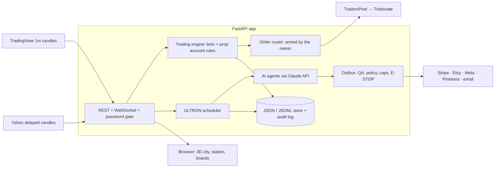

# Nexus City

[](https://github.com/levetteit/nexus-city/actions/workflows/ci.yml)

**A 3D operations dashboard where trading bots and AI agents work under human-set rules.**

Nexus City is a single FastAPI application with two sides:
- **The City.** Python bots trade micro futures for a prop firm account. The MNQ bots are on by default, and the MES bots can be switched on. Each bot lives in its own building in a Three.js city.
- **The Space Station.** ULTRON, a scheduler built on the Claude API, runs a crew of AI agents. They research, draft and operate small online ventures: digital products, an Etsy shop, social content and outreach.

The two sides share one treasury and one audit log. Both run inside limits that code enforces: AI agents draft and propose; checks, caps, approvals and an emergency stop decide what actually reaches the outside world.

> Formerly **StarNet**. Old `STARNET_*` settings still work; see [docs/MIGRATION_FROM_STARNET.md](docs/MIGRATION_FROM_STARNET.md).

## Screenshots

| The City | A bot's streamer room |
|---|---|
|  |  |

To try it locally, run the simulation (see [Local setup](#local-setup)). It needs no keys or accounts.

## Architecture overview



- **One process.** The trading loop, the station scheduler and the web server are asyncio tasks in one process.
- **No database.** State lives in JSON and JSONL files on a mounted disk, written atomically. See [docs/PERSISTENCE.md](docs/PERSISTENCE.md).

## Key capabilities

**Trading (City)**
- **The strategy:** a rules-based intraday strategy (PROC: fair-value-gap taps plus multi-timeframe pointers), read on NQ/ES and executed on the micros.
- **Account rules:** prop firm rules are modelled in code: drawdown, daily goal, cap and stop, consistency limits and payouts.
- **Backtesting:** a backtester and walk-forward optimizer that replay real 1-minute candles. Strategy Forge tests candidate changes, runs the survivors as shadow paper bots, and leaves promotion to the owner.
- **Live paper trading:** runs on real candles, with a news blackout filter, daily reports and a check of live trading against a replay.
- **Real orders (optional):** sent through TradersPost, guarded by an explicit `ARM`, stale-data blocks, session cutoffs and a flatten-and-disarm.

**AI operations (Space Station)**
- **The crew:** ULTRON schedules a crew of agents: research, validation, marketing, content, outreach, QA and an auditor. Every agent call uses structured outputs.
- **The board:** ventures move through stages on a Command Board, with approvals, tasks, a War Room review and lessons the agents carry forward.
- **The outbox:** every outbound action (post, email, listing, payment link) is a draft first. It passes a compliance check, a per-kind send policy and daily caps, and it stops at an emergency stop.
- **Money:** one treasury with per-venture P&L, AI spend caps and a hash-chained ledger. Only real, verified money counts.
- **Jarvis API:** a token-protected endpoint lets an outside operator act on the board within a fixed allowlist. It is refused for anything that touches money, trading or accounts.

## Technology stack

| Area | Tools |
|---|---|
| Backend | Python 3.12, FastAPI, Uvicorn, asyncio, WebSockets |
| AI | Anthropic Claude API (structured outputs, web search tool) |
| Frontend | Vanilla ES modules, Three.js, a hand-written canvas chart; installable as a phone app (manifest and service worker) |
| Integrations | TradersPost, TradingView (Pine script webhook), Yahoo Finance, Stripe, Etsy, Printify, Meta Graph API, Pinterest, SMTP/IMAP, ntfy and Web Push |
| Storage | JSON and JSONL files with atomic writes and a hash-chained ledger |
| Delivery | Docker, Render (blueprint in `render.yaml`), GitHub Actions |
| Quality | pytest (unit and integration), coverage, pyflakes, gitleaks, pip-audit |

## Safety and human-in-the-loop model

| Area | What a human must do | What code enforces regardless |
|---|---|---|
| Real orders | Arm execution with an explicit `ARM`; promote any strategy change | Stale-data blocks, 15:50 ET entry cutoff, 15:55 ET flatten, account loss limits, exits that can only reduce a position |
| Money | Approve spending, funding and goals; record payouts | No code path moves money; income is booked only from the owner or signed Stripe events; AI budget caps |
| Outbound actions | Optionally require approval per kind (`NEXUS_POLICY_*=owner`) | Compliance check, daily caps, emergency stop, connector checks, idempotent Stripe calls |
| Ventures | Kill a venture; open accounts | Auto-launch limits (score, one a day, 3 live) and an automatic close after 21 days with no sale |
| Everything | | An append-only audit log of who changed what and why |

> By default, outbound actions that pass the compliance check are sent automatically
> (`NEXUS_POLICY_*=auto`). Set the policy to `owner` for any kind that should wait for a person.

Full details: [docs/SECURITY.md](docs/SECURITY.md), including its threat model and known limitations.

## Project structure

```text
backend/            FastAPI app (main.py), trading engine, bots, prop account, order router, backtester, Strategy Forge
backend/station/    ULTRON, agents, connectors, outbox, store, treasury
frontend/           the 3D city and station, the Command Board, rooms and charts
tests/              pytest suite (fixtures/ holds 5 days of real 1-minute candles)
kits/               finished products the station can publish
tradingview/        Pine script that streams 1-minute candles to the app
docs/               the deep documentation (index below)
```

## Local setup

```bash
git clone https://github.com/levetteit/nexus-city.git && cd nexus-city
python3.12 -m venv .venv && source .venv/bin/activate
pip install -r requirements.lock -r requirements-dev.txt
uvicorn backend.main:app --reload        # http://localhost:8000, simulated market, no keys needed
```

`NEXUS_TICK_SECONDS=0.1` runs the simulated market 10× faster. More detail is in [docs/DEVELOPMENT.md](docs/DEVELOPMENT.md).

## Environment configuration

Every setting is listed in [`.env.example`](.env.example), grouped by area and with placeholders only. Copy it to `.env`, which git ignores, and run with `--env-file .env`.

| Setting | Purpose |
|---|---|
| `NEXUS_MODE` | `sim` (default: random-walk market) or `live` (real candles, paper trading) |
| `NEXUS_PASSWORD` | The app's password; in live mode the app answers 503 until one is set |
| `ANTHROPIC_API_KEY` | Turns on the AI trading desk and the station's agents |
| `NEXUS_POLICY_*` | Per-kind send policy for outbound actions: `auto` or `owner` |

Secrets come only from the environment and are masked in logs and errors.

## Testing

```bash
python -m pytest -q                  # 186 tests, ~30 s; the network is blocked during tests
python -m pytest -q -m "not integration"
python -m pyflakes backend tests
```

CI runs four jobs on every pull request:
- **lint**
- **pytest** with coverage
- **security**: gitleaks over the full history, and pip-audit on the lockfile
- **docker**: builds the image and smoke-tests it

See [docs/DEVELOPMENT.md](docs/DEVELOPMENT.md).

## Deployment

- **Docker:** the `Dockerfile` builds a single image.
- **Render:** `render.yaml` deploys it to Render with a password and a persistent disk, and every push to `main` redeploys.
- **Anywhere else:** the same image runs on any Docker host. Set `NEXUS_PASSWORD`, mount a volume at `/app/data` and expose port 8000.

A deploy restarts the app, and on startup it closes any positions the order router had open. Deploy while the bots are flat.

Step-by-step hosting, phone alerts and monitoring are in [docs/OPERATIONS.md](docs/OPERATIONS.md).

## Project status

- **Single-owner project.** It is in daily use by its owner: hosted on Render in live paper mode, with real-order routing wired to one prop firm account.
- **Trading results:**
  - Backtest: 21 days of real 1-minute data (Sep–Oct 2026). That is a small sample and not evidence of future performance.
  - Forward test: paper trading is ongoing.
  - Details: [docs/TRADING.md](docs/TRADING.md).
- **Station:** live. Some outbound channels wait on third-party approvals or tokens.
- **Known gaps:** the trading-reliability issues in [docs/ENGINEERING_AUDIT.md](docs/ENGINEERING_AUDIT.md) (C-1, T-H1 to T-H7) are documented. Fixes for them are approved but not yet implemented.

## Roadmap

1. **Trading reliability:** supervise the trading loop and make `/healthz` detect a stall. Send exits while disarmed, use wall-clock flatten timing, keep account halts across restarts, and retry orders safely.
2. **Persistence:** move from JSON files to PostgreSQL along the schema already designed in [docs/PERSISTENCE.md](docs/PERSISTENCE.md), once the data outgrows one disk.
3. **Station:** reconnect the expired social tokens, finish the Pinterest app review, and test channels with real traffic.
4. **Docs:** an architecture document with diagrams, and a modernization report.

## Documentation

| Document | Contents |
|---|---|
| [docs/CITY.md](docs/CITY.md) | The 3D city: weather, streamer rooms, skins, shuttles, the shared world |
| [docs/TRADING.md](docs/TRADING.md) | The strategy, sizing, sessions, prop account rules, real-data results, backtesting, Strategy Forge |
| [docs/LIVE_TRADING.md](docs/LIVE_TRADING.md) | Live paper trading, the news filter, the AI trading desk, reports, real orders, TradingView setup |
| [docs/STATION.md](docs/STATION.md) | ULTRON, the agents, ventures, the outbox, treasury, connectors, Jarvis |
| [docs/OPERATIONS.md](docs/OPERATIONS.md) | Hosting on Render, phone alerts, the watchdog |
| [docs/SECURITY.md](docs/SECURITY.md) | Threat model, authentication, secrets, agent boundaries, safeguards |
| [docs/PERSISTENCE.md](docs/PERSISTENCE.md) | Storage, durability, recovery, the PostgreSQL design |
| [docs/DEVELOPMENT.md](docs/DEVELOPMENT.md) | Setup, tests, CI, dependencies |
| [docs/ENGINEERING_AUDIT.md](docs/ENGINEERING_AUDIT.md) | The engineering audit: findings and their status |
| [docs/MIGRATION_FROM_STARNET.md](docs/MIGRATION_FROM_STARNET.md) | The StarNet → Nexus City rename |

## Author

Built by **Jerai Padilla** ([@levetteit](https://github.com/levetteit)), with AI pair-programming from Claude Code.
