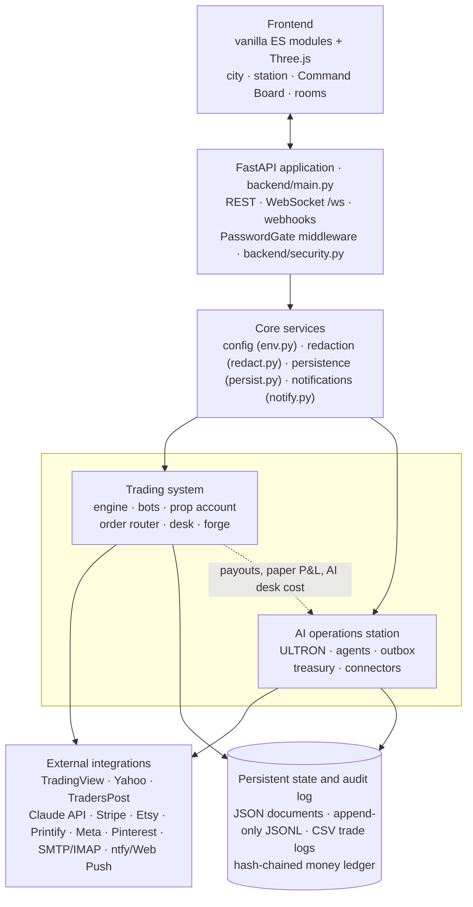
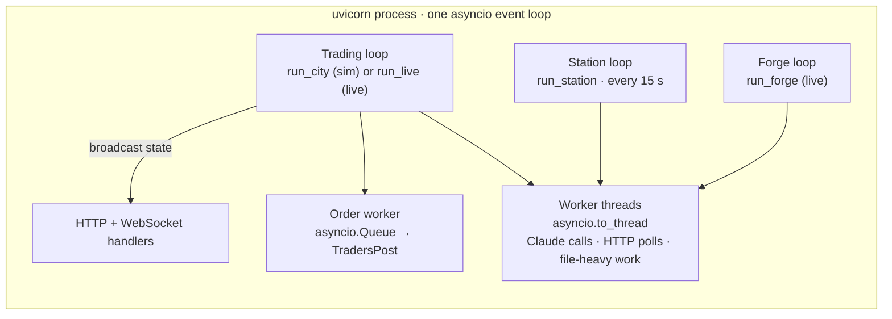
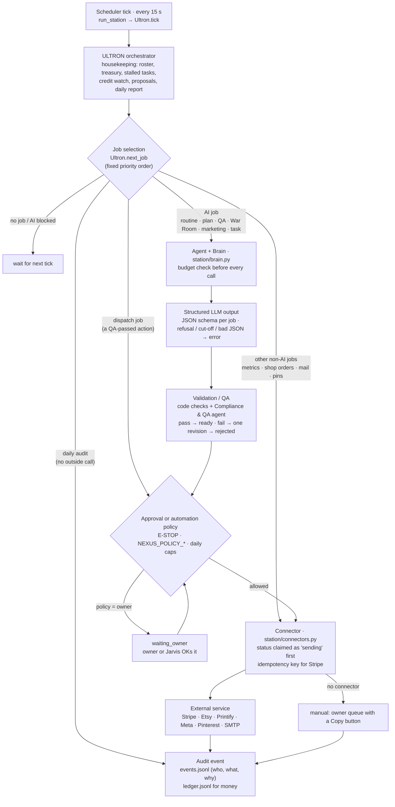
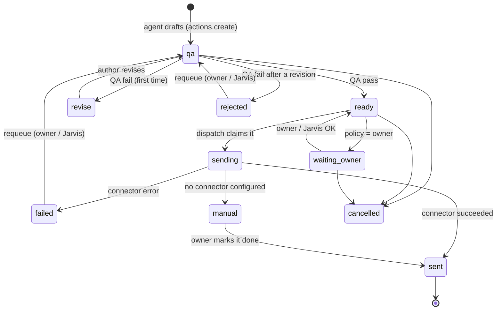
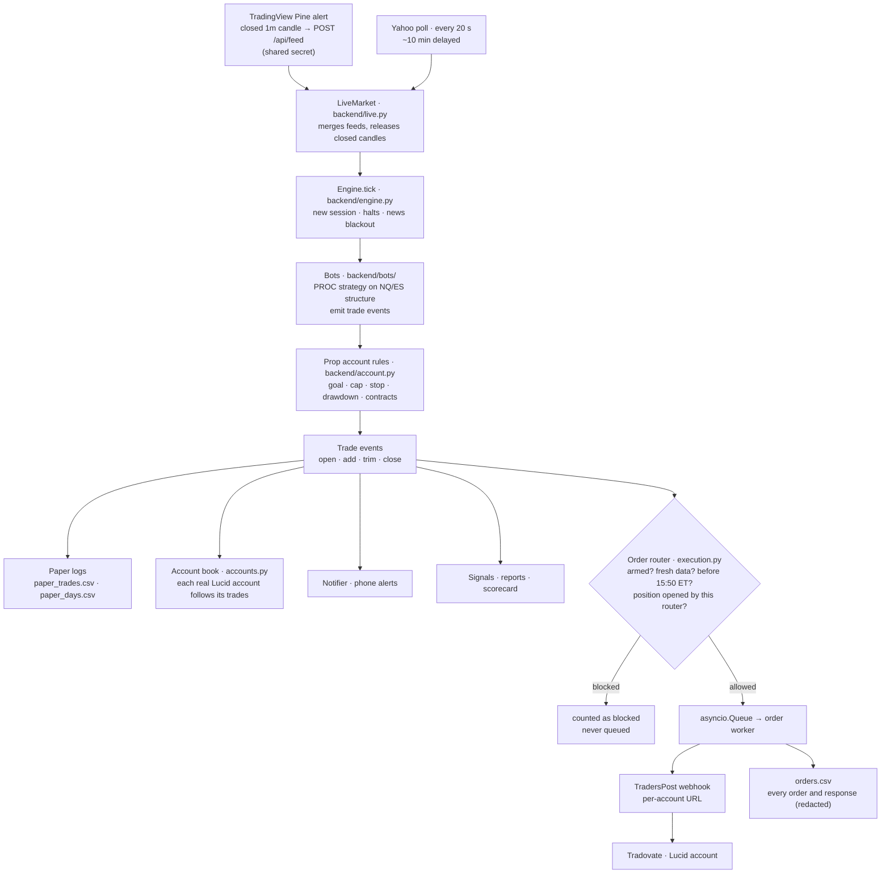
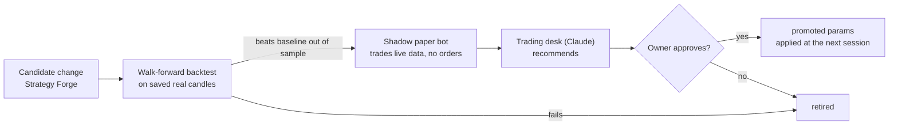
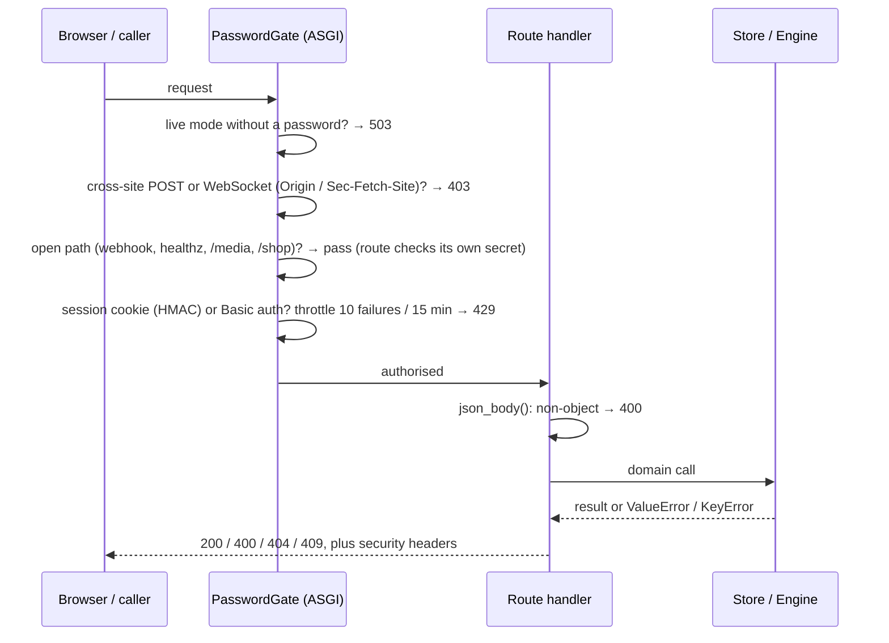

# Architecture

Nexus City is one Python 3.12 process: a FastAPI application. It runs two long-lived asyncio loops beside the web server:
- **the trading loop**, which steps the bots and the prop account through market data;
- **the station loop**, in which ULTRON schedules work for the AI agents.

Both loops write to files on one mounted disk, and both are observed through the same REST/WebSocket API by a
browser frontend. This document describes the layers, the runtime model, and the main flows. Each claim names
the module that implements it.

## 1. System layers

| Layer | Responsibility | Main modules |
|---|---|---|
| Frontend | Renders state, sends owner commands. Holds no business logic | `frontend/city.js`, `world.js`, `room.js`, `station3d.js`, `station.js` |
| API | Routing, request validation, authentication, cross-site protection, security headers, webhook verification | `backend/main.py`, `backend/security.py` |
| Core services | Settings with the `NEXUS_*`/`STARNET_*` fallback, secret masking, atomic file writes, phone notifications | `env.py`, `redact.py`, `persist.py`, `notify.py` |
| Trading system | Market data, strategy, prop account rules, real-order routing, research tools | `engine.py`, `bots/`, `account.py`, `accounts.py`, `execution.py`, `live.py`, `backtest.py`, `forge.py`, `desk.py` |
| AI operations station | Scheduling, agent work, outbound actions, money accounting | `backend/station/` |
| External integrations | One adapter per service. Each failure becomes a `ConnectorError` with secrets masked | `station/connectors.py`, `execution.py`, `live.py`, `news.py`, `notify.py` |
| Persistent state | Station records, audit log, ledger, trading logs and account state | `station/store.py`, `station/economy.py`, `persist.py`; files under `NEXUS_DATA_DIR` |

**Boundaries between the two domains.** The station reads the trading side but never drives it. It reads the
account (payouts, paper P&L) to keep the treasury current, and it books the trading desk's Claude cost to the City.
It cannot place, size or arm orders. That boundary is in code: ULTRON has no reference to the order router, and
Jarvis refuses the trading venture (`backend/jarvis.py`).

## 2. Runtime model

- **Startup** (`lifespan` in `main.py`):
  - logs any deprecated setting names (names only);
  - builds ULTRON, then starts the trading loop and the station loop.
  - **Live mode only:** downloads recent candles, warms the bots on history without trading, restores the prop account, and starts the order router. That router step closes any positions left open by the previous process.
- **Blocking work is kept off the event loop.** Claude calls, HTTP polls, replays and file writes run in worker threads with `asyncio.to_thread`. The station runs **one agent job at a time**, so its spend and side effects are easy to reason about.
- **Failure isolation.**
  - The station loop catches every exception from a tick and records it on `station.last_error`, so the station cannot stop the City.
  - Each ULTRON job has its own recovery path (`Ultron._job_failed`). When Claude is unreachable, the job waits for a back-off; any other failure skips it.
  - Known gap (audit **C-1**): nothing supervises the trading loop yet.
- **Shared state.** The station store serialises access with one re-entrant lock. The trading engine is owned by the trading loop.

## 3. AI operations workflow

### 3.1 From schedule to audit event

1. **Scheduler.** `run_station` calls `Ultron.tick` every 15 seconds. The tick keeps the roster and the treasury current. It catches stalled or failed tasks, watches the Claude credit balance, proposes ventures and goals, and writes the daily report.
2. **Job selection.** `Ultron.next_job` is an explicit priority list:
   1. Jobs that don't call Claude come first. Sending QA-passed actions comes first among them, then the daily audit, engagement metrics, shop orders, credit reconciliation, the outreach inbox and kit pins.
   2. AI jobs follow, and only if the Claude client exists, the monthly AI budget allows it, credits aren't exhausted and no back-off is active. In order: venture planning, QA, revisions, the War Room, Jarvis-requested routines, marketing plans, daily content, outreach, scheduled research routines, Etsy shop research, product creation and queued agent tasks. Tasks are capped per day.
3. **Agent and Brain.**
   - `Brain` wraps the Claude API: `structured()` for JSON-schema outputs, and `research()` for web search with citations.
   - Every call is checked against the budget first and charged to the treasury afterwards.
   - The agent's role, standing rules and the lessons the War Room recorded (`crew.lessons_text`) go into the system prompt.
4. **Structured output.**
   - Each job asks for a fixed JSON schema.
   - A refusal, a cut-off answer (retried once), missing text or invalid JSON raises a clear error. The job's recovery path then handles it.
5. **Validation and QA.**
   - Agents can only create *drafts*. `actions.create` stores every outbound action with status `qa`.
   - The Compliance & QA agent returns a verdict. A pass becomes `ready`; a fail becomes `revise` (once), then `rejected`.
   - Code-level rules run regardless. For outreach: no repeat contacts, no opted-out addresses, and a public inquiry page is required.
6. **Policy.** `actions.dispatch` sends only QA-passed actions, and only when all of these hold:
   - The outbound E-STOP is off.
   - The kind's policy is `auto`, or the owner has OK'd it.
   - The day's cap for that kind is not reached.
7. **Connector.**
   - The action is marked `sending` *before* the external call, so a crash can't make the loop send it twice.
   - A known connector error marks it `failed`. An unexpected error marks it `failed` with `check_before_resending`, because the side effect may have happened.
   - Stripe calls carry an idempotency key derived from the action id.
8. **Audit.**
   - Every state change goes through `Store.update`/`Store.event`, which appends to `events.jsonl` with the actor, the reason and a timestamp.
   - Money goes to `ledger.jsonl`, where each entry hashes the previous one.

### 3.2 Outbound action lifecycle

An action that is `sending` cannot be cancelled. After a restart, ULTRON recovers any action left in `sending`
and marks it for a check before it is resent.

### 3.3 Who can do what

| Actor | Can | Cannot |
|---|---|---|
| Agents (via ULTRON) | Research, plan, draft, revise, analyse; create tasks and drafts | Send anything without QA and policy; spend; book income; touch trading |
| ULTRON | Schedule jobs, retry or escalate tasks, propose ventures and funding goals, auto-launch within limits | Approve spending, move money, act on outside accounts, change orders or risk |
| Jarvis (`POST /api/jarvis/act`, token) | Run allowlisted board operations: retry or cancel tasks, edit or requeue drafts, OK social posts, run routines, convene the War Room, decide no-cost approvals | Anything about money, Stripe links, the trading desk, killing a venture, or anything needing an account (403) |
| Owner (password session) | Everything above, plus spending approvals, killing ventures, arming real orders, promoting strategies | — |

## 4. Trading flow

### 4.1 Market data to orders

1. **Data.**
   - With a paid plan, a TradingView Pine script pushes each closed 1-minute candle to `/api/feed`. The request is authenticated with a shared secret.
   - Yahoo is polled every 20 seconds as a delayed fallback.
   - The bots read NQ/ES structure and trade the micros (MNQ/MES).
2. **Engine.** Each candle advances `Engine.tick`. A new trading day rolls the account through `end_of_day`. Account halts and news blackouts stop the bots before they act.
3. **Strategy and risk.** The bots (`bots/proc.py`) emit open, add, trim and close events. The prop account (`account.py`) enforces the firm's rules: daily goal, cap and stop, end-of-day drawdown, consistency and contract limits.
4. **Fan-out.** The same events feed:
   - the paper trade log;
   - every configured real account (`accounts.py`);
   - phone notifications;
   - the signal log, the daily report and the live-vs-replay scorecard;
   - the order router.
5. **Order router** (`TradersPostRouter.handle`). Orders go out only when every check passes:

   | Check | Rule |
   |---|---|
   | Armed | Off until the owner sends `ARM`; flatten-all also disarms |
   | Data freshness | Entries and adds are refused when prices are more than 2.5 minutes old; exits always go |
   | Session cutoff | No entries from 15:50 ET; the bots flatten by 15:55 (Tradovate's micro session ends at 16:00) |
   | Ownership | Adds and exits only for positions this router opened |

   Allowed orders go onto a queue. A worker posts them to TradersPost, retries failures and logs every attempt to `orders.csv` with the URLs masked.
6. **Restart.** `router.start()` sends exits for any position the previous process left open, because the bots restart flat.

Known gaps in this flow (audit **T-H1 to T-H7**, fixes approved) are listed in [SECURITY.md](SECURITY.md#7-trading-safeguards).

### 4.2 Changing the strategy safely

`Engine.apply_params` changes parameters only at a session boundary (`pending_params`), never in the middle of a trade.

## 5. Request path and security

Webhooks authenticate themselves:
- **TradingView feed and signal:** a shared secret in the body.
- **Stripe:** a signature checked against the webhook secret.
- **Jarvis:** a bearer token.

Details: [SECURITY.md](SECURITY.md).

## 6. Persistence

| Data | Format | Writer | Notes |
|---|---|---|---|
| Station records (ventures, tasks, actions, approvals, agents, routines, opportunities…) | `<collection>.json` | `station/store.py` | Whole-file atomic replace (temp file, fsync, rename) |
| Audit log | `events.jsonl` | `Store.event` | Append-only; a line torn by a crash is moved aside at startup |
| Money ledger | `ledger.jsonl` | `station/economy.py` | Append-only, hash-chained; each sale booked once by reference |
| Prop account and router state | `paper_account.json`, router state | `live.py`, `execution.py` | Atomic writes |
| Trading logs | `paper_trades.csv`, `paper_days.csv`, `orders.csv` | `live.py`, `execution.py` | Append; secrets redacted |
| Candle history | `history/<SYMBOL>_1m.csv` (Yahoo and TradingView copies) | `history.py` | Merged as candles arrive; feeds the backtester and Strategy Forge |

In production all of this lives on one Render disk mounted at `/app/data`. The trade-offs and a PostgreSQL schema
for later are in [PERSISTENCE.md](PERSISTENCE.md).

## 7. Design decisions

| Decision | Why | Cost |
|---|---|---|
| One process, asyncio loops | One deploy unit, shared in-memory state, nothing else to operate | No horizontal scaling; a trading-loop crash isn't supervised yet (C-1) |
| Files, not a database | Survives restarts on one disk, easy to inspect and back up, no extra service | One writer only; queries are scans; the PostgreSQL design is ready when needed |
| LLM output is a draft, code decides | Prompts aren't a security boundary: QA, policy, caps, the E-STOP and allowlists are enforced in Python | More states to manage (section 3.2) |
| One agent job at a time | Predictable spend, simple concurrency, readable audit log | Throughput bounded by one Claude call at a time |
| Structured outputs everywhere | Every agent result is machine-checkable before it changes state | Schemas must evolve with the prompts |
| Vanilla JS frontend | No build step; the server serves files directly | Less tooling (no type checking in the browser code) |
