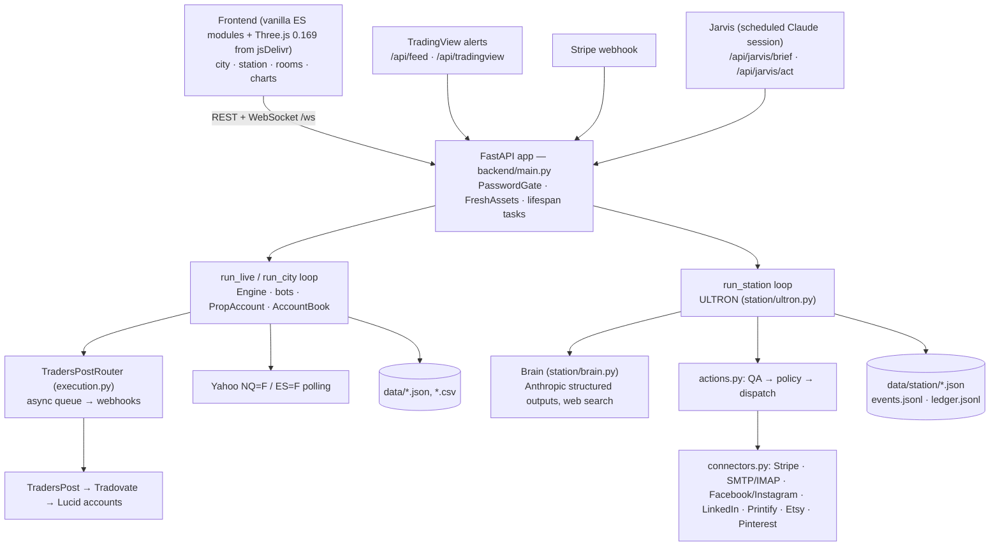

# Nexus City — Engineering Audit (Phase 1 baseline)

**Date:** 2026-10-07 · **Commit audited:** `794c5b3` (main) · **Scope:** whole repository, read-only

This is the baseline for the modernization work. Nothing in the application was changed to produce it.
Findings cite `file:line` at the audited commit. The most serious ones were re-verified by reading the code
directly. Each one has a severity and, where it matters, a note on whether fixing it would change
**trading behaviour**. Those changes need the owner's sign-off.

---

## 1. Baseline

| Check | Result |
|---|---|
| Test suite (`python -m pytest -q`) | **117 passed, 1 skipped** (Python 3.13 locally; CI runs 3.12; the code also compiles on 3.11) |
| Skipped test | `tests/test_strategy.py::test_twenty_one_day_baseline`: needs the 21-day data set in `data/`, which is not committed |
| Tests collected | 118, in 13 files (station 44, account 14, strategy 11, router 10, api 8, jarvis 6, accounts 5, forge 5, watcher 5, watchdog 4, news 3, signals 2, history 1) |
| Repository size | ~15.2k lines of Python (backend ~11k, tests ~3.5k, kit build scripts ~0.8k) and ~6.2k lines of frontend JS/HTML/CSS; 126 commits from 2026-10-05 to 2026-10-07 |
| Visibility | **Public** on GitHub (`levetteit/nexus-city`; `levetteit/starnet` is the same repository under its old name) |
| Secret scan of the full git history | **No real credentials found.** Only obvious test placeholders (`sk-ant-...-test`, `buy.stripe.com/x`, `app-pass`) |
| CI | `.github/workflows/tests.yml`: Python 3.12, `pip install -r requirements.txt pytest httpx`, `pytest -q tests`, on pushes to main and on PRs |

---

## 2. System map

**Entry point.** `uvicorn backend.main:app`, run with **one worker by design**: the bots, accounts and order queue
live in process memory (`Dockerfile:13-14`). The lifespan starts two long-running tasks (`main.py:345-346`):

- `run_live()` (live mode) or `run_city()` (simulation) — the trading loop.
- `run_station()` — ULTRON's loop. It runs one AI or housekeeping job at a time in a worker thread, every 15 s.

### Trading pipeline
1. **Candles in.** Yahoo is polled every 20 s (`live.py:57`). TradingView pushes closed 1-minute candles to
   `/api/feed`; while a full-size NQ1!/ES1! chart is feeding, its micro chart is ignored (`live.py:84-102`).
2. **Bots trade them.** `Engine.tick` runs the session roll, risk checks and each bot. The bots are `ProcBot` and
   `WatcherBot`, configured in `config.py`.
3. **Events become orders.** Bot events go to `AccountBook.observe` (per-account routing) and then to
   `TradersPostRouter.handle`, which sends webhook orders only while armed.
4. **Safeguards.** Arming requires `confirm: "ARM"`. New entries are blocked on stale data (> 2.5 min old) and
   after 15:50 ET. Positions are flattened at 15:55 ET. The account enforces the prop firm's daily stop, goal,
   cap and MLL. Flatten-all also disarms. On restart, the router closes positions it had open.

### AI operations pipeline
1. **Job selection.** `Ultron.tick` does housekeeping, then `next_job` picks one job in a fixed priority order
   (`ultron.py:201-273`):
   - First, jobs with no model call: dispatch, audit, metrics, shop orders, credits, mail, kit pins.
   - Then the AI gate: AI budget, credits, backoff.
   - Then AI jobs: plan, QA, revise, War Room, marketing plan, content, outreach, routines, research,
     products, agent tasks.
2. **Model calls.** `Brain.structured` calls Claude with JSON-schema output. `Brain.research` uses the web-search tool.
3. **Outbound actions.** Every outbound action goes through `actions.create` (status `qa`), then an LLM
   compliance/QA check, then `dispatch`. Dispatch requires QA `pass`, the outbound switch (E-STOP), the policy
   for that action kind and the daily caps. The outcome is `sent`, `manual`, `failed` or `waiting_owner`.
4. **Owner-only decisions.** Approvals for funding, spending, Forge promotion and killing a venture.
   `jarvis.act` refuses money, accounts and the trading desk with HTTP 403.
5. **Persistence.** One JSON file per collection, an append-only `events.jsonl` audit log, and a hash-chained
   `ledger.jsonl` treasury ledger.

### External side effects (everything that touches the outside world)
| Path | Side effect | Guard |
|---|---|---|
| `execution.py` `_worker` | Real futures orders through TradersPost | Armed flag, staleness check, 15:50 cutoff, exits-only resize semantics |
| `station/actions.py` `dispatch` | Social posts, outreach email, Stripe payment links, Printify/Etsy listings, storefront publish | QA verdict, policy (all default **auto**), daily caps, outbound E-STOP |
| `station/kits.py` | Stripe link and Etsy listing (Etsy charges a $0.20 listing fee) on **Publish**; Pinterest pins drip daily | Owner presses Publish; the pins are **not** behind the E-STOP (see S-H4) |
| `notify.py` | Web push, ntfy | — |
| `station/connectors.py` OAuth | Etsy and Pinterest token exchange | `state` + PKCE, behind the password gate |
| `forge.py` | Writes `data/strategy.json`, which changes live bot settings | Owner approval (`strategy_promote`) |

---

## 3. Findings

Severity scale:
- **CRITICAL** — can cause unmanaged real-money exposure or loss of the system with no signal.
- **HIGH** — real money, security or data loss under plausible conditions.
- **MEDIUM** — correctness or security weakness with limited blast radius.
- **LOW** — hygiene.
- **FUTURE** — scaling and architecture.

⚠ **trading** = the fix changes trading behaviour and needs the owner's sign-off.
⚠ **behaviour** = the fix changes product behaviour.

### CRITICAL

**C-1. Nothing supervises the live trading loop, and `/healthz` cannot tell that it stopped.**
- **Where:** `main.py:115-140`. Inside `run_live`, the per-candle block (`engine.tick` → `live.record` →
  `book.observe` → `router.handle` → notifier, signals, reports, scorecard) and the watchdog call have no
  `try/except`. Only the Yahoo poll is wrapped.
- **What happens:** any exception ends the `asyncio` task started at `main.py:345`, and nothing restarts it. The
  web app keeps serving, and `/healthz` (`main.py:429`) still returns ok. Bots stop trading, open real positions
  are no longer managed (no exit on a PROC against, no 15:55 flatten), and the watchdog that would alert the
  owner runs inside the same dead loop.
- **Fix (no trading change):** wrap each candle's processing and the watchdog in `try/except` with logging and an
  owner alert. Supervise the task: restart it, or mark the app unhealthy. Make `/healthz` report a stalled loop
  using a last-tick timestamp.

### HIGH — security

**S-H1. Cross-site request forgery can reach order-arming and flatten endpoints.**
- **The gap:** there is no Origin, `Sec-Fetch-Site` or custom-header check on state-changing requests.
  - The cookie is `SameSite=Lax` (`main.py:400`), so a cross-site POST does not carry it.
  - But the gate also accepts HTTP Basic credentials (`main.py:371-378`), and browsers re-send cached Basic
    credentials on cross-site top-level form POSTs.
  - Handlers also parse request bodies regardless of Content-Type (`main.py:652`).
- **What a hostile page could do:** submit a form to `/api/execution/flatten` (`:702`); a `text/plain` form
  shaped as JSON to `/api/execution` (arming); or similar forms to `/api/accounts`, `/api/station/outbound`
  and venture endpoints.
- **Fix:** in `PasswordGate`, reject non-GET requests whose `Origin` / `Sec-Fetch-Site` is cross-site. Exempt the
  webhook paths in `OPEN_PATHS`. The frontend's `fetch` calls are same-origin and need no change.

**S-H2. With no password set, everything is public, including arming real orders.**
- **Where:** `PasswordGate.__call__` lets every request through when `STARNET_PASSWORD` is empty (`main.py:382`).
  `render.yaml` marks the password `sync: false`, so a missed value on a new deploy means a fully open app with
  live order controls.
- **Fix:** in live mode, refuse to start without a password, or refuse every request except `/healthz`.
  Keep simulation mode open for local development.

**S-H3. The session cookie is a static, unsalted hash of the password.**
- **Where:** `main.py:364`, cookie value `sha256("starnet:" + PASSWORD)`.
- **Why it matters:**
  - The value is the same for every session and never changes unless the password does.
  - It is checked with a substring match, not a constant-time comparison (`:369`).
  - There is no limit on Basic-auth attempts.
  - A leaked cookie allows an offline password guess.
  - There is no `Secure` flag (`:400`).
- **Fix:** `HMAC(server_secret, password)` with a persisted random key, a constant-time comparison, the `Secure`
  flag, and per-IP failure throttling.
- **Side effect:** every browser has to log in once more after the change.

### HIGH — trading execution

**T-H1. Disarming leaves open real positions unmanaged.**
- **Where:** `handle()` returns immediately when the router is not armed (`execution.py:136-137`). So after
  disarming, the bot's exit is never sent, which contradicts the module's own "exits are always sent"
  (`execution.py:17`).
- **Also:** the stale `open` entry stays recorded, and is overwritten by the next `trade_open` after re-arming.
- **Fix:** keep sending exits for positions in `self.open` while disarmed, or flatten when disarming. ⚠ trading

**T-H2. Order retries can duplicate real entries.**
- **Where:** `_worker` retries any non-2xx response or exception up to 3 times, including the 10 s read timeout
  (`execution.py:220-240`). A timed-out POST that TradersPost already accepted is sent again, which can double an
  entry or an add.
- **Fix:** retry opens and adds only on connection-level failures. Exits and resizes are safe to retry as they are.

**T-H3. The order worker can die or misreport.**
- **Where:** `_worker` has no exception guard around `_log` and `url_names` (`execution.py:235-240`), so one
  exception stops it and every later order queues forever.
- **Also:**
  - `last_error` is cleared by the next success, so a failed exit to one account can be hidden by a success
    on another (`:232`, read at `main.py:143`).
  - The queue lives only in memory. A popped-and-saved exit lost to a restart leaves an orphaned real position.
- **Fix:** guard the worker and keep an error list. On startup, reconcile `open` against what the queue
  actually sent.

**T-H4. Time-based exits only run when a candle arrives.**
- **Where:** the 15:55 flatten (`bots/base.py:242`) and the news flatten (`engine.py:101`) run inside `tick`,
  which only runs when a candle is released.
- **Why it matters:** on the Yahoo fallback (about 10 minutes late) the 15:55 exit would go out after Tradovate's
  16:00 session end. A stalled feed means no flatten at all.
- **Fix:** add a wall-clock flatten check in the live loop. ⚠ trading

**T-H5. Synchronous handlers change the engine from a threadpool.**
- **Where:** `toggle` (`main.py:442`), `execution_flatten` (`:703`) and `reset_account` (`:869`) are plain `def`
  endpoints, so they run in worker threads while the loop is ticking.
- **Risks:**
  - a double close;
  - an event appended between `list(self.events)` and the clear (`engine.py:75`) is lost, and with it the real exit;
  - `asyncio.Queue.put_nowait` called from another thread (`execution.py:219`).
- **Fix:** make them `async def`, so they run on the event loop like the tick.

**T-H6. The restart flatten waits on Yahoo.**
- **Where:** `router.start()` (`main.py:87`) only runs after the news refresh and the full Yahoo download
  (`:75-76`). If Yahoo is down at boot, leftover real positions are never exited.
- **Fix:** build the router and call `start()` first.

**T-H7. A restart clears some account halts.**
- **Where:** `load_account` calls `_start_day()` (`live.py:143`), which resets `halted` and `loss_streak`. A
  "3 losses in a row" or profit-lock halt is undone by a redeploy (and every merge redeploys).
- **Also:** warmup with `tick(trade=False)` skips the day roll (`engine.py:49-53`), so a restart that spans
  18:00 ET carries yesterday's realized P&L into today.
- **Fix:** save both fields and roll the day during warmup. ⚠ trading

### HIGH — AI station

**A-H1. Outbound dispatch is not idempotent, so one error can repeat a side effect every 15 s.**
- **Where:** `dispatch` only catches `ConnectorError` (`station/actions.py:180`). `stripe_request` only turns
  HTTP errors into `ConnectorError` (`connectors.py:79-87`), so a timeout or `URLError` (or a `FileNotFoundError`
  in `digital.publish` after the link exists) escapes.
- **What happens:** the action stays `ready`, and dispatch is the loop's first priority. It is retried every
  15 s, creating duplicate Stripe products and payment links (no idempotency key is sent) and blocking every
  other job.
- **Fix:** claim the action (`status=sending`) before the outside call, catch everything into `failed`, and send
  a Stripe `Idempotency-Key` equal to the action id.

**A-H2. A torn last line in a JSONL log can stop the app.**
- **Where:** `Store.events()` (`station/store.py:104-117`) parses every line, so a partial last line of
  `events.jsonl` (crash mid-append) breaks the station's tick and dashboard for good. The same in `ledger.jsonl`
  stops `Treasury.__init__`, so the app does not start.
- **Fix:** skip and report an unparseable trailing line on read.

**A-H3. Document read-modify-write is unlocked, so an opt-out can be lost.**
- **Where:** `save_doc` / `load_doc` do not take `store.lock` (`store.py:131-139`). `contacts.json` is changed by
  the request thread (opt-out endpoint), the dispatch worker and the mailbox reader. An opt-out can be
  overwritten by a concurrent dispatch, which is a CAN-SPAM exposure. `lessons.json`, `shop.json` and
  `ultron.json` (cfg, also mutated from handlers and `jarvis.act`) have the same race.
- **Fix:** an `update_doc(name, fn)` helper that does the read-modify-write under the lock.

**A-H4. The outbound E-STOP does not cover kit pins.**
- **Where:** the `kit_pin` job posts to Pinterest outside QA, the E-STOP and the caps (`ultron.py:219-221`,
  `kits.py:157`).
- **Fix:** check `cfg["outbound"]` in the job.

**A-H5. Treasury writes are not atomic, so a payout could be booked twice.**
- **Where:** `treasury.json` and `counters.json` are written with plain truncating writes (`economy.py:238-240`,
  `store.py:127-129`). Payouts are booked before `payouts_synced` is saved, so a crash in between re-books a
  Lucid payout.
- **Fix:** atomic writes, and check the payout reference before booking.

### HIGH — repository and operations (owner decisions, not code fixes)

**O-H1. The public repository holds commercial and personal business material.**
- **What is exposed:**
  - the caregiver binder PDFs that are sold on Etsy (`kits/caregiver-care-binder/*.pdf`), downloadable free;
  - Padilla Property Solutions' business details and its real Facebook Page ID (`tests/test_station.py`);
  - the live service hostname;
  - the trading strategy specifics.
- **Why it matters:** deleting these from `main` does not remove them from git history.
- **Owner's choice:**
  - make the repository private and publish a sanitized portfolio copy; or
  - move kits and business details out of the repository and rewrite history (`git filter-repo`);
    this is destructive, so it is not done here.
- **Owner decision (2026-10-07):** keep the repository public for now; the owner will make it private later.
  No history rewrite.

**O-H2. Every merge to `main` redeploys and restarts the trading process.**
- **Where:** `render.yaml` sets `autoDeploy: true`. A restart closes real positions (by design, `execution.py:19`),
  so even documentation-only merges during market hours have a trading cost.
- **Fix:** Render build filters, so docs/tests/CI-only changes don't deploy, or merge only while flat (current
  practice).

### MEDIUM

| ID | Finding | Evidence | Recommendation |
|---|---|---|---|
| M-1 | The feed accepts future timestamps and non-finite prices. A future candle makes `delay_minutes` negative, so the staleness guard passes, and every later real candle is dropped. `delay_minutes` also reads 0 before the first candle | `main.py:609-611`, `live.py:100,127-129` | Reject `t > now+90s` and NaN/inf; treat no-data as stale |
| M-2 | Unescaped third-party text in `innerHTML` on the origin that can arm orders: news titles from an external feed, TradersPost error bodies | `frontend/city.js:673, 769, 771, 1175` (the order-log view does escape, `:948`) | Wrap in the existing `esc()` |
| M-3 | A TradingView alert's `price` re-anchors the live mark, so a bad value can trigger a false stop or MLL breach | `engine.py:168`, `market.py:144` | Ignore `price` in live mode, or bound it to the last candle |
| M-4 | The book diverges from the router after a skipped open: the book counts the trade, the router never sent it. A blocked add followed by a trim resizes the shared webhook to 1 while the bot holds 3 | `execution.py:151-158, 171, 188` | The router reports skips back to the book; use the event's `left` quantity ⚠ trading |
| M-5 | Trading state files are written non-atomically (a corrupt `execution.json` crashes startup) | `execution.py:96`, `live.py:149`, `accounts.py:69` | Use `forge.py`'s temp + `os.replace` pattern |
| M-6 | `cfg` is changed from three threads; `json.dump` can raise "dict changed size" | `ultron.py` `_save_cfg`, `main.py:1236,1248`, `jarvis.py` | Copy under a lock |
| M-7 | `events()` reads the whole JSONL file on the event-loop thread several times per tick, plus 11 times every 5 minutes with a 20,000 limit. It slows as the log grows | `store.py:104`, `warroom.py:74`, `ultron.py:425`, `recognition.py:39,80` | Keep an in-memory ring buffer; rotate the file |
| M-8 | Anthropic 429/529 are treated as permanent: a QA'd action becomes `failed` | `ultron.py:377-415` | Treat them as transient (backoff) |
| M-9 | A cancel or "done" can race a dispatch already in flight (`sent` overwrites `cancelled`) | `main.py:1214-1222`, `actions.py` | Compare-and-set on status |
| M-10 | All station policies default to `auto` and auto-launch is on. LLM QA is the only gate before payment links and listings go out, and the ULTRON docstring says it "never publishes" | `actions.py:32-38`, `ultron.py:12-13, 53` | Document accurately; consider `owner` as the default for `stripe.payment_link` ⚠ behaviour |
| M-11 | One-symbol TradingView feed: late Yahoo rows for the partner symbol fail `> last_seen` and are dropped, so ES confirmation works from frozen data | `live.py:61` | Track `last_seen` per symbol ⚠ trading |
| M-12 | The worker posts serially with up to about 36 s per URL, so one hung webhook delays other accounts' exits | `execution.py:220-240` | Per-URL timeouts and concurrency for exits |

### LOW

| ID | Finding | Evidence |
|---|---|---|
| L-1 | Malformed non-ASCII secrets cause 500s: `hmac.compare_digest(str, str)` raises, and Stripe's `t=` goes through an uncaught `int()` | `main.py:377, 600, 897`; `connectors.py:115` |
| L-2 | Meta Graph tokens are sent as `?access_token=` query parameters (exceptions do not echo them) | `connectors.py:240, 295, 306, 314` |
| L-3 | OAuth tokens are stored as plaintext JSON (mode 0600, never returned by any API). OAuth itself is sound: state, PKCE S256, fixed redirect URI | `connectors.py:449-460, 519` |
| L-4 | User-set webhook and push URLs are POSTed to with only an `https://` check | `accounts.py:81,96`; `notify.py:72-75` |
| L-5 | The public storefront thanks/download routes call the Stripe API for any `cs_…` id with no caching or rate limit | `main.py:1153, 1169`; `digital.py:391` |
| L-6 | The feed rejection log reveals the secret's length (authenticated views only) | `main.py:603` |
| L-7 | Three.js and fonts load from CDNs with no Subresource Integrity | `frontend/index.html:40-44`, `station3d.html:96-98` |
| L-8 | `front_month` uses the UTC date, so it rolls one evening early in ET | `execution.py:54` |
| L-9 | Market hours are defined three times (16:45 / 17:00 / 16:45) | `main.py:233`, `watchdog.py:25`, `market.py:22` |
| L-10 | `Brain.structured` raises a bare `StopIteration` when there is no text block. `research()` loses earlier content on `pause_turn`, and truncated research notes are returned silently | `station/brain.py:79, 101` |
| L-11 | AI cost is booked at hard-coded Opus prices even when a fallback model served the call | `station/economy.py:26` |
| L-12 | `test_api.py` sets `os.environ` at import time (it leaks into other tests). There is no global network guard in `conftest.py`, so a test that misses a mock could reach a real host if real keys are in the shell | `tests/test_api.py:11`, `tests/conftest.py` |
| L-13 | Swallowed errors: `digital.retire` ignores Etsy deactivation failures; `kits.sync` `OSError` is ignored | `digital.py:370-372`; `ultron.py:189` |
| L-14 | Inconsistent day boundaries: UTC for send caps, ET for the `capped` list | `actions.py:125`; `ultron.py:313` |

---

## 4. Technical debt

**Dead code.**
- `backend/bots/pointer.py` (320 lines): `PointerBot` is no longer in `WORKERS`. Only `SIGNALS` is imported
  (`main.py:25`), and `is_pointer` is duplicated in `bots/proc.py:117`.

**Very large units.**

| Unit | Location | Size |
|---|---|---|
| `backend/main.py` | 52 endpoints, the live loop, middleware and helpers | 1,464 lines |
| `Ultron.run_job` | `station/ultron.py:275-421` | 147 lines |
| `jarvis.act` | `jarvis.py` | 111 lines |
| `render_pdf` | `station/digital.py` | 87 lines |
| `Ultron._seed` | `station/ultron.py` | 85 lines |
| `run_live` | `main.py` | 85 lines |
| `renderWorker` | `frontend/city.js` | ~176 lines |
| `makeBuilding` | `frontend/city.js` | ~112 lines |

`_seed` runs one-off data migrations on every start.

**Duplication.**
- The Stripe link → product → Etsy listing → pin sequence appears in both `digital.publish` and `kits.publish`.
- `contract.endswith("LONG")` side parsing appears in 4 places.
- The "mark contacted" logic appears twice in `actions.py`.

**Hard-coded values.**
- Venture, agent and mission IDs (`V-001`, `V-PPS`, `M-001`, `A-002`).
- "Oct 13" and "The Auto Plug PR" in seed notes.
- `BASELINE` dates in `scorecard.py:30`.
- The 10- and 5-minute cutoffs repeated across `bots/base.py`, `bots/proc.py` and `execution.py`.
- `AVG_DAY=400` in `scale.py`.
- The 8-day contract roll.
- The beta header string.

**Shared constants in odd places.** `ET` is defined in `backtest.py` and imported everywhere.

**Docs that contradict behaviour.** ULTRON's docstring says it never publishes or contacts anyone; the default
policies are `auto`.

**`busy` stall guard is a no-op.** Tick and job are serialized in one coroutine, so `busy` is always `None` when
checked (`ultron.py:432`).

---

## 5. Naming (StarNet → Nexus City), for Phase 2

**Scale.** 274 matching lines in 43 files. Variants: `StarNet`, `Starnet`, `STARNET`, `starnet_*`,
`starnet-city`, `starnet-data`.

| Category | Examples | Rename risk |
|---|---|---|
| A. User-facing | page titles (`index.html`, `station*.html`), `manifest.json`, notification titles (`sw.js`, `watchdog.py`, `main.py`), the Basic-auth realm, the FastAPI title, the store name default "StarNet Studio" (on PDF covers and the storefront), the AI system prompts, the Pine indicator name | Safe |
| B. Internal identifiers | notification tag, User-Agent strings, multipart boundary, push contact mailto | Safe |
| C. Environment variables | **59 distinct `STARNET_*` names**: `MODE`, `PASSWORD`, `DATA_DIR`, `FEED_SECRET`, `WEBHOOK_SECRET`, `JARVIS_TOKEN`, `TRADERSPOST_WEBHOOKS`, `SMTP_*`, `FB_*`, `POLICY_*` and others | **Breaking**: live Render secrets use them. Read `NEXUS_*` first and fall back to `STARNET_*` |
| D. Persisted data | no data file names contain "starnet"; the stored venture name "Starnet City Trading Desk" (V-001, seeded once); the Render disk `starnet-data` | The disk name must **not** change (it would give an empty disk). The venture name needs a data migration |
| E. API contracts | Stripe metadata keys `starnet_venture` / `starnet_product` (written `connectors.py:94`, `digital.py:324`, `kits.py:125`; read by the webhook `economy.py:112,117`) | **Breaking** for existing payment links. Write new keys, keep reading both |
| F. Auth/session | cookie `starnet_auth`, hash salt `starnet:`; sessionStorage `starnet_intro` | Renaming logs browsers out once (acceptable) |
| G. Deployment | `render.yaml` service `starnet-city`, which sets the public host `starnet-city.onrender.com`; `Dockerfile` env | **Do not rename the service.** The host is registered with Etsy/Pinterest OAuth, the Stripe webhook, TradingView alerts, push subscriptions and posted media URLs |
| H. Comments/docs | ~75 lines (44 in README) | Safe |
| I. Compatibility-critical | env names, Stripe metadata, the service name and host, the disk name, the Pine script (alerts must be recreated if it changes), the cookie | Covered above |

---

## 6. Dependencies and deployment

**`requirements.txt`.**
- 6 entries, all `>=` with no upper bound except `anthropic<2`, and no lockfile.
- Imported but not listed:
  - `pytest` and `httpx`: installed ad hoc in CI.
  - `cryptography` and `py_vapid`: imported directly in `notify.py`, transitive via pywebpush.
  - `httpx2`: imported by tests, transitive via anthropic.
  - `reportlab` and `fontTools`: used only by the kit build scripts, not at runtime.

**Python version.** 3.12 in Docker and CI. No 3.13-only syntax.

**Dockerfile.**
- Runs as root, with no `HEALTHCHECK` (Render uses `/healthz` instead).
- Copies `backend`, `frontend` and `kits`.
- `.dockerignore` excludes `.git`, `data`, `docs` and `kits/*/source`.

**`render.yaml`.**
- Declares only 7 of the roughly 40 variables the deployment uses. Stripe, SMTP, social, Etsy/Pinterest,
  Printify, `JARVIS_TOKEN` and `PUBLIC_URL` are set by hand in the dashboard.
- 1 GB persistent disk at `/app/data`.

**Backups.** There are no backups of `data/`, which holds the audit log, the ledger, the accounts and OAuth tokens.

---

## 7. Tests and CI

**Well covered.**
- Prop-firm account rules.
- PROC strategy baselines on recorded data.
- Router queueing, trims and contract rolls.
- The password gate and the Jarvis token, including refusals.
- Stripe webhook signature.
- Feed secret.
- The OAuth connect URL.
- Ledger tamper evidence.
- Station QA → dispatch with mocked connectors.

**Gaps.**
- **Router:** `_worker` is never run, so retries, duplicates, partial failure and worker death are untested.
  Disarm with an open position is untested.
- **Live loop:** `run_live` exception handling; `LiveMarket` release logic; a restart restoring halts; the session
  roll after downtime.
- **Endpoints:** `/api/execution` arm/flatten and `/api/tradingview` have no endpoint tests.
- **OAuth:** the callback and state rejection.
- **Persistence:** corrupt or partial JSON and JSONL.
- **Station failures:** non-`ConnectorError` failures in dispatch; Anthropic 429/529, refusal and malformed
  output; concurrency of documents and cfg.
- **Tests don't block real network access.** There is no global network guard. Every external call is mocked
  per test, but a missing mock could reach a real host if real keys are present in the developer's shell.

**CI does not run** lint or static checks, secret detection, dependency vulnerability scanning, or a Docker build.

---

## 8. Documentation

**README.** 1,065 lines, 26 sections. It is an operator manual: market weather, skins and apparel, Render setup,
going live. It has no architecture summary, project status or developer quick-start near the top.

**`docs/`.** Only two screenshots.

**Missing.** Architecture, security, persistence, configuration reference (`.env.example`), contribution and
testing guide.

---

## 9. What is already good (keep it)

- **Real boundaries for AI actions.** QA verdicts, per-kind send policy, daily caps, an outbound E-STOP, an
  append-only audit log of every state change, a hash-chained treasury ledger, and `jarvis.act` refusing money
  and account operations in code with 403.
- **Webhook and OAuth security is sound.** Stripe webhook signature with timestamp tolerance; constant-time
  secret comparisons on the webhooks; OAuth `state` + PKCE S256 with a fixed redirect URI.
- **File serving is safe.** Strict regexes on `/media/` and PDF names; the storefront HTML is fully escaped.
- **No secrets in code or history.** Status endpoints never return webhook URLs or tokens.
- **Layered trading safeguards.** The arm confirmation, the data-staleness block, the time cutoffs, the restart
  flatten, and prop-firm rules modelled in code with tests.
- **Strategy changes are validated before they go live.** The Forge's walk-forward validation, a paper shadow,
  and owner promotion.
- **A substantial, fast test suite.** 118 tests in about 30 s, with external services mocked.

---

## 10. Recommended order of work

1. **Phase 2 — naming** (owner agreed 2026-10-07). Do it backward-compatibly: `NEXUS_*` first, `STARNET_*` fallback; keep the Render
   service and disk names and the Stripe metadata readers.
2. **Phase 3/4 — safe security fixes.** S-H1 (Origin check), S-H2 (live mode needs a password), S-H3 (HMAC
   cookie + Secure + throttle), M-1, M-2, L-1. A-H1, A-H2, A-H3, A-H4 and A-H5 change no trading behaviour.
3. **Trading reliability that doesn't change strategy.** C-1, T-H2, T-H3, T-H5, T-H6, M-5.
4. **Owner sign-off first.** T-H1, T-H4, T-H7, M-4, M-11 (these change trading behaviour).
   **Owner decision (2026-10-07): approved.** They will be implemented with tests in the trading-reliability work; M-10 (send policy
   default); O-H1 (repository visibility/history); O-H2 (deploy filters).
