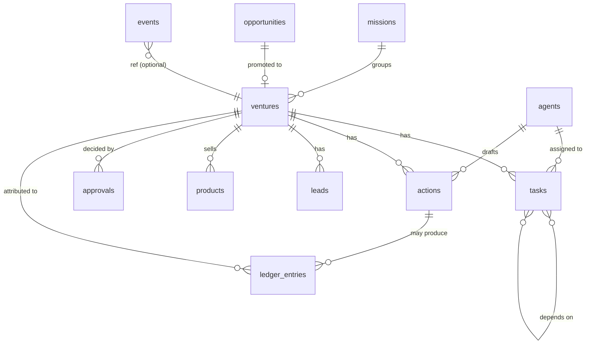

# Nexus City — Persistence

Nexus City keeps its state in **plain files** on one disk, `NEXUS_DATA_DIR` (`/app/data` on Render, a 1 GB
persistent disk). This document covers:
- how that storage works and what protects it;
- where its limits are;
- how it would move to PostgreSQL when it outgrows files.

The current design is deliberate. The app runs as **one process** (`--workers 1`): the trading bots, accounts and
order queue live in memory, and state is small. A database server would add an operational dependency without
solving a current bottleneck. Section 6 says when that changes.

---

## 1. What is stored where

```text
<data dir>/
├── station/                     AI operations station (backend/station/store.py, economy.py)
│   ├── ventures.json  agents.json  tasks.json  approvals.json  opportunities.json
│   ├── missions.json  routines.json  actions.json  leads.json  products.json      one file per collection
│   ├── counters.json            next id per collection (V-001, T-012, X-040, ...)
│   ├── events.jsonl             append-only audit log: every state change, who, why
│   ├── ledger.jsonl             append-only, hash-chained treasury ledger (money in/out, AI usage)
│   ├── treasury.json            bills, goals, scale settings, payout sync counter
│   ├── tokens.json              Etsy / Pinterest OAuth tokens (mode 0600)
│   └── docs/                    free-form documents: ultron.json (loop config), contacts.json
│                                (sent / do-not-contact), lessons.json, shop.json, purchases.json, kits.json,
│                                mailbox.json, credits.json, reports, scans
├── execution.json               real-order router: armed flag + positions it has open
├── accounts.json                Lucid accounts (rules state, own webhook URL)
├── paper_account.json           the paper prop-firm account
├── paper_bots.json              each bot's lifetime P&L (unlocks room gadgets)
├── forge.json  strategy.json    Strategy Forge state and the promoted live settings
├── paper_checks.json            paper-vs-backtest scorecard
├── watchdog.json                watchdog expectations
├── push_subscriptions.json      web-push subscriptions;  vapid.pem: web-push key
├── session.key                  login cookie signing key (mode 0600)
├── news_calendar.json           cached economic calendar
├── orders.csv                   every real order sent and its response
├── paper_trades.csv  paper_days.csv   paper trading journal
├── reports/  desk/  signals/    daily reports, trading-desk journals, signal checks (one file per day)
└── history/                     saved 1-minute candles (Yahoo and TradingView), for backtests and the Forge
```

**Process memory only (lost on restart, by design):**
- open bot positions (the router closes real positions on startup);
- the order queue;
- the account book's per-trade membership;
- the station's busy flag.

## 2. How writes work

| Kind | Mechanism | Guarantee |
|---|---|---|
| JSON state files: collections, counters, docs, treasury, execution, accounts, paper account, … | `backend/persist.py` `write_json_atomic`: write a temp file in the same directory, `fsync`, then `os.replace` | A crash leaves the old version or the new one, never a partial file |
| Station collections | Kept in memory (`Store.data`). Each change rewrites that collection's file under one re-entrant lock | Readers and writers in the event loop, threadpool and worker thread never interleave |
| Station documents | `save_doc` / `load_doc` take the lock. Read-modify-write goes through `update_doc(name, change)` | Two threads can't overwrite each other's change (e.g. an opt-out arriving during a send) |
| Audit log `events.jsonl`, ledger `ledger.jsonl` | Append one JSON line per event or entry, under the lock | Append-only; the ledger's SHA-256 chain makes edits detectable (`Treasury.verify_chain`) |
| CSV journals (`orders.csv`, paper trades and days, candle history) | Append one row | Append-only; a torn last row affects only that row |

**Crash recovery at startup:**
- **Torn last line in `events.jsonl` or `ledger.jsonl`:** a crash mid-append can leave a last line without its
  newline.
  - `repair_jsonl_tail` moves the fragment to `<file>.torn-<time>`, so it is kept for review and never silently lost.
  - Later appends then start on a clean line.
  - A `storage.repaired` WARNING event is written.
- **Unreadable lines elsewhere:** they are skipped and counted (`Treasury.bad_lines`, `Store.bad_event_lines`),
  so a bad line can't stop the app from starting.
- **Interrupted outbound sends:** an action left `sending` by a restart is marked `failed` with
  `check_before_resending`. It is never resent automatically (see `docs/SECURITY.md`).
- **Payouts:** each Lucid payout carries a reference (`lucid-payout-N`) and is checked before booking, so a crash
  between booking and saving the counter can't book it twice.

**Reading the audit log.**
- `Store.events()` parses the log once, then reads only what was appended since the last call.
- It ignores a line that is still being written.
- It no longer re-reads the whole file on every check.

## 3. Concurrency model

```text
event loop thread ── run_live tick (engine, router, account book) ── async endpoints ── ULTRON tick (housekeeping)
threadpool        ── sync (def) endpoints
worker thread     ── one ULTRON job at a time (LLM calls, connector calls)
subprocess        ── weekly Strategy Forge run (reads candle files, writes forge.json atomically)
```

- Station state is protected by `Store.lock`, a re-entrant lock that every read and write of collections and
  documents takes.
- The trading state (`engine`, accounts, router) is mutated on the event loop. A few synchronous endpoints also
  touch it from the threadpool: finding T-H5, fixed in the trading-reliability work.

## 4. Risks and limits of the current design

| Area | Today | Impact |
|---|---|---|
| Atomicity across files | Each file is atomic on its own. A change touching two files (e.g. an action marked sent plus a venture's link) is not one transaction | After a crash between the two writes, records can disagree. The audit log shows what happened |
| Write cost | Every change rewrites the whole collection file | Fine at today's size (hundreds of records); grows linearly |
| Log growth | `events.jsonl` and `ledger.jsonl` grow forever. The event log is held in memory once read | A few MB per year at the current rate; needs rotation eventually |
| Queries | Filtering is a full scan in memory | Fine now; no indexes |
| Multiple processes | Unsafe: the lock is per process, so two app instances would overwrite each other | The deployment runs exactly one instance (`--workers 1`, one Render service) |
| Backups | None automatic. Render's disk is a single volume | Losing the disk loses the accounts, audit log, ledger and OAuth tokens |
| Durability | Atomic replace with `fsync` on the file. The directory is not fsynced; the last change before a power loss can be lost | Acceptable: no money moves in code, and the ledger is append-only |

**Backup recommendation (owner action).** Snapshot the data directory daily. Two options:
- Render disk snapshots, which are point-in-time and handled by Render.
- A scheduled job that copies `station/*.jsonl`, `station/*.json`, `station/docs/`, `accounts.json`,
  `execution.json` and `paper_account.json` to off-site storage.

**Restore.** Stop the service, put the files back, then start it.

## 5. Storage interface

`backend/station/store.py` defines `StationStore`, a `typing.Protocol` listing what the station needs:

| Method | Purpose |
|---|---|
| `all`, `get`, `find` | Read records |
| `create`, `update` | Write records; each one also writes an audit event |
| `event`, `events` | Append to and read the audit log |
| `save_doc`, `load_doc`, `update_doc` | Free-form documents |
| `lock` | The store's lock |

`Store` (also exported as `JSONStore`) is today's implementation. A `PostgresStore` would implement the same
methods, so ULTRON, the agents, the connectors and the endpoints don't change. The trading-side files (router,
accounts, paper account) are small single-document states and would move later behind a similar
`StateStore.get/put(name)` interface.

## 6. Future PostgreSQL design

**When to move** — any of these:
- more than one app instance (high availability, or separating the web tier from the trading loop);
- multi-user access;
- needing transactions across records (e.g. "mark sent and record the link" atomically);
- query needs beyond in-memory scans;
- the audit log outgrowing memory.

### Schema



| Table | Primary key | Key columns | Indexes |
|---|---|---|---|
| `missions` | `id text` (M-001) | name, state, goal, budget, created_at | — |
| `ventures` | `id text` (V-001) | name, stage, category, owner_business, autonomous, mission_id → missions, opportunity_id → opportunities, offer, channels `text[]`, compliance `jsonb`, marketing_plan `jsonb`, launched_at | (stage), (mission_id) |
| `agents` | `id text` (A-002) | name, role, department, kind, status, current_task_id | (status) |
| `opportunities` | `id text` (OP-001) | title, score, status, startup_cost_usd, recommendation, payload `jsonb` | (status, score desc) |
| `tasks` | `id text` (T-001) | venture_id → ventures, assigned_agent_id → agents, kind, status, attempts, priority, day, instructions, output `jsonb`, error | (status, priority), (venture_id) |
| `task_dependencies` | (task_id, depends_on_id) | both → tasks | (depends_on_id) |
| `actions` | `id text` (X-001) | kind, venture_id, agent_id, status, payload `jsonb`, qa `jsonb`, revisions, result `jsonb`, owner_ok, sent_at | (status, created_at), (venture_id, kind), (kind, sent_at) for daily caps |
| `approvals` | `id text` (AP-001) | kind, venture_id, action, cost, reversible, status, payload `jsonb`, requested_at, decided_at, owner_response | (status) |
| `leads` | `id text` (L-001) | venture_id, source, status, amount, note, action_id | (venture_id, status) |
| `products` | `id text` (PR-001) | venture_id, slug **unique**, title, price_usd, active, checkout_url, payment_link, etsy `jsonb`, pin `jsonb` | (venture_id, active), unique (slug) |
| `routines` | `id text` (R-001) | name, station, days, at, last_run, status, runs | — |
| `events` | `id bigserial` | at `timestamptz`, kind, by, summary, severity, ref, data `jsonb` | (at desc), (kind, at desc), (ref, at desc) |
| `ledger_entries` | `id bigserial` | at, kind, amount `numeric(12,4)`, unit, source, note, venture_id, agent, ref **unique where not null**, prev_hash, hash | (kind, at), (venture_id), unique (ref) |
| `documents` | `name text` | doc `jsonb`, updated_at | — (replaces `station/docs/`) |
| `contacts` | `email text` | contacted_at, venture_id, action_id, do_not_contact `bool` | (do_not_contact) |
| `accounts` | `id text` | name, webhook_url (encrypted at rest), state `jsonb` | — |
| `integration_tokens` | `service text` | access/refresh token (encrypted with a key from the environment), expires_at, scope | — |
| `app_state` | `name text` | doc `jsonb`, updated_at (execution, paper account, forge, treasury config) | — |

### Design notes

**IDs.** Keep today's readable IDs (V-001, X-040) as primary keys, generated from per-table sequences (replacing
`counters.json`). The UI, audit log and Jarvis all reference them.

**Transactions.** One transaction per state change, together with its audit event:
- `create` / `update` = `INSERT`/`UPDATE` + `INSERT INTO events` in one transaction.
- An action's final status + a venture's new link + the ledger entry for a sale = one transaction (fixes the
  cross-file gap in §4).
- Claiming an action for sending: `UPDATE actions SET status='sending' WHERE id=$1 AND status IN ('ready','waiting_owner') RETURNING *`.
  This is a compare-and-set, so only one worker can claim it.

**Audit and ledger.**
- `events` stays append-only: the app role gets `INSERT`/`SELECT` only, with no `UPDATE`/`DELETE`.
- The ledger keeps its hash chain. The `prev_hash` → `hash` chain is written inside the same transaction as the
  entry, and a unique `ref` makes double-booking impossible at the database level.

**Migrations.** Use versioned migration files (e.g. Alembic, or plain SQL files with a `schema_version` table).
The one-off fix-ups in `Ultron._seed` (venture renames, offer backfill) become numbered data migrations.

**Moving the data.**
1. Add `PostgresStore` behind `StationStore`.
2. Write a one-time importer that loads the JSON collections in id order, replays `events.jsonl` and
   `ledger.jsonl` (verifying the chain), and copies the documents.
3. Run both stores in shadow mode for a while (write to both, read from JSON, compare).
4. Switch reads.
5. Keep the JSON files as the rollback.

**Operations.**
- **Connections:** a connection pool. Agent jobs run in a worker thread, so use a sync driver
  (`psycopg` 3 with `ConnectionPool`), or move the jobs to async.
- **Backups:** managed point-in-time recovery from the database provider, replacing the manual snapshots in §4.
