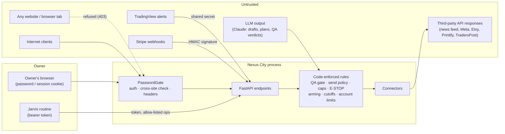

# Nexus City — Security

This document describes how Nexus City protects its owner's accounts, money and reputation: what it trusts, where the
boundaries are, which safeguards exist in code, and what is known to be missing.

Nexus City is a **single-owner** application. One person operates it through a password-protected web app. Scheduled
automation (ULTRON's station loop, the trading loop and the "Jarvis" operations routine) acts on that person's behalf
within the limits below.

To report a vulnerability, open a private security advisory on the GitHub repository. Please don't open a public issue.

---

## 1. What is being protected

| Asset | Why it matters |
|---|---|
| Real trading accounts (Lucid via TradersPost → Tradovate) | Real money: orders, open positions, account rules (daily stop, max loss) |
| Payment and commerce accounts (Stripe, Etsy, Printify) | Payment links, listings (Etsy charges a fee per listing), sales records |
| Owner's public channels (Facebook Page, Instagram, LinkedIn, email sender) | Reputation and legal exposure (CAN-SPAM opt-outs, platform rules) |
| Credentials (API keys, OAuth tokens, webhook secrets, the app password) | Every item above |
| Station records, audit log (`events.jsonl`) and hash-chained ledger (`ledger.jsonl`) | Accountability: what was done, by whom, and why |

## 2. Trust boundaries

- **Untrusted input:** everything from the internet, webhooks, third-party API responses and **LLM output**.
  LLM output is treated as untrusted data. A model can draft, propose and grade, but code decides what can happen
  and enforces it.
- **Owner:** the holder of `NEXUS_PASSWORD` (HTTP Basic, then a session cookie) has full control.
- **Jarvis:** the holder of `NEXUS_JARVIS_TOKEN` can read a briefing and perform allow-listed board operations. It
  cannot touch money, accounts or the trading desk (§6).

## 3. Threat model (summary)

| Threat | Mitigation | Where |
|---|---|---|
| Stranger reaches the app | Password on every page, API call and the WebSocket. In live mode the app refuses to serve anything without a password set | `backend/security.py` |
| Password guessing | 10 wrong passwords per address in 15 minutes → 429; constant-time comparisons | `backend/security.py` |
| Stolen or guessed session cookie | Cookie = HMAC-SHA256(random server key, password); HttpOnly, SameSite=Lax, Secure on https; rotating the key or password signs everyone out | `backend/security.py` |
| Cross-site request forgery: another site makes the owner's browser arm or flatten orders | State-changing requests and WebSockets from another origin (or marked `Sec-Fetch-Site: cross-site`) are refused | `backend/security.py` |
| Clickjacking the order buttons | `X-Frame-Options: DENY` and `frame-ancestors 'none'` | `backend/security.py` |
| Forged webhooks | TradingView/feed: shared secret, constant-time. Stripe: HMAC signature with a 5-minute tolerance | `backend/main.py`, `station/connectors.py` |
| Bad or malicious candle data | Feed candles must have finite, positive, consistent prices and no future timestamps | `backend/main.py` `/api/feed` |
| XSS from outside text (news titles, API error bodies, LLM text) | Frontend escapes outside text before rendering; server-rendered storefront pages escape every field | `frontend/*.js` `esc()`, `station/digital.py` |
| Path traversal | Media and PDFs served only by strict random-name regexes; static files via Starlette's guard | `station/media.py`, `station/digital.py` |
| Secret leakage through errors, logs or UI | Errors and log lines pass through `redact()`, which masks secret values and credential shapes; tokens never sent in URLs to Meta; status APIs return booleans only | `backend/redact.py` |
| Prompt injection steering an agent to act | Agents only produce drafts. Every outbound action goes through QA, policy, caps and the E-STOP; money and account actions are owner-only in code | §6 |
| Duplicate side effects (double payment links or emails) | Actions are claimed (`sending`) before the outside call, never retried automatically after an unexpected error, and Stripe calls carry idempotency keys | `station/actions.py`, `station/connectors.py` |

## 4. Authentication model

- **Owner login.** HTTP Basic with `NEXUS_PASSWORD`. On success the server sets `nexus_auth` (the former name
  `starnet_auth` is still read).
  - The cookie value is `HMAC-SHA256(key, password)`, where `key` is 32 random bytes kept in
    `<data dir>/session.key` (mode 0600).
  - To sign every browser out, change the password or delete `session.key`.
- **Open paths**, which have their own protection:
  - `/healthz`: exposes only the watchdog's problem list.
  - `/api/feed` and `/api/tradingview`: shared secret.
  - `/api/station/stripe/webhook`: Stripe signature.
  - `/api/jarvis/*`: bearer token of at least 24 characters, compared in constant time; 404 when unset.
  - `/media/*`: unguessable names.
  - `/shop/*`: the public storefront.
- **Limitations.**
  - There is one shared password and no per-user accounts or roles.
  - The lockout is in memory and per address, so it resets on restart.
  - Basic credentials are cached by the browser until it is closed.

## 5. Secrets strategy

- **Where secrets live.** Secrets come only from environment variables (`.env.example` lists every setting;
  placeholders only). Nothing secret is committed. The full git history was scanned in Phase 1 and was clean.
- **Generated at runtime and stored in the data directory (never in git):**
  - `session.key`
  - the web-push VAPID key (`vapid.pem`)
  - Etsy and Pinterest OAuth tokens (`station/tokens.json`, mode 0600)
- **Never exposed.**
  - No API response returns a secret or a webhook URL; status endpoints return booleans.
  - Account webhook URLs stay on the server.
  - `redact()` masks secrets in errors, logs and anything shown in the app.
  - Webhook bodies that fail to parse are never echoed, because they can contain the secret.
- **Rotation.** Change the variable on the host, then redeploy.
  - Rotating `NEXUS_FEED_SECRET` or `NEXUS_WEBHOOK_SECRET` also means updating the TradingView script and alerts.
  - Rotating `STRIPE_WEBHOOK_SECRET` means updating the Stripe dashboard.

## 6. Agent authorization boundaries (bounded agency)

AI agents research, draft, analyze, coordinate and propose. Code decides what reaches the outside world:

1. **Outbound actions** (social posts, outreach email, Stripe payment links, listings, storefront products) are
   created as drafts (`qa`). From there:
   - **LLM compliance/QA check.** It must return `pass`; one revision is allowed, then the draft is `rejected`.
   - **Send policy** (`NEXUS_POLICY_*`, `auto` or `owner`): `owner` waits for an explicit OK.
   - **Daily caps** per kind.
   - **Outbound E-STOP** (`/api/station/outbound`). It also stops kit pins.
   - **Connector checks**, for example: a Facebook Page only accepts posts from the venture that owns it.
2. **Owner-only in code.** Approvals that spend money, fund goals, promote a trading strategy, or kill a venture.
   Real-order arming needs an explicit `confirm: "ARM"`.
3. **Jarvis** (`backend/jarvis.py`) runs a fixed allow-list of board operations. It is refused (403) for:
   - spending, funding and Stripe links;
   - the trading desk and live orders;
   - killing a venture;
   - any task or launch that needs an account, a payment or the owner's identity.

   Every Jarvis action is written to the audit log as `jarvis`.
4. **Audit.** Every state change is written to the append-only `events.jsonl` with who did it and why. Money
   movements also go to the hash-chained ledger, which detects tampering.

⚠ **Configured automation.** By default every `NEXUS_POLICY_*` is `auto` and `NEXUS_AUTO_LAUNCH=1`, so a
QA-passed draft is sent without a human. That includes Stripe payment links: creating a link moves no money, but it
puts an offer in front of buyers. Set `NEXUS_POLICY_STRIPE=owner` (or any other kind) to require approval.

## 7. Trading safeguards

| Safeguard | Behaviour |
|---|---|
| Arming | Real orders are off until the owner arms them with an explicit `ARM` confirmation. Flatten-all also disarms |
| Data freshness | New entries and adds are blocked when prices are more than 2.5 minutes old |
| Session cutoffs | No entries or adds from 15:50 ET; positions are flattened at 15:55 ET (Tradovate's micro session ends at 16:00) |
| Account rules | Daily goal, cap and stop; maximum loss limit; losing-streak stop; contract limits; news blackouts (`backend/account.py`, `backend/news.py`) |
| Exits | Sent as TradersPost `exit` / `resize`, which can only reduce a position, never reverse it |
| Restart | Positions the router had open, and exits that were still queued, are closed on startup before any market download, because the bots restart flat |
| No duplicate entries | Entries and adds are resent only when the request never reached TradersPost; after a timeout or any reply they are not, so a second position can't open. Exits and resizes are always retried |
| Order worker | Never stops on an error; each webhook's failure stays reported until that webhook succeeds again |
| Loop supervision | Each step of the live loop is guarded, so a broken log or report can't stop real orders. If the loop dies or stalls for 5 minutes, `/healthz` returns 503 and the owner is alerted |
| Strategy changes | Strategy Forge candidates must pass a walk-forward test and a paper shadow, then the owner approves them |

**Fixed in the trading-reliability work:** C-1 (loop supervision), T-H2 (duplicate entries), T-H3 (order worker),
T-H5 (engine changes from worker threads) and T-H6 (restart flatten waited for Yahoo).

**Known gaps, approved, not yet implemented** (they change trading behaviour; see `docs/ENGINEERING_AUDIT.md`):
- **T-H1:** exits are not sent while disarmed.
- **T-H4:** time-based exits depend on candle arrival.
- **T-H7:** a restart clears account halts.

## 8. Financial safeguards

- **No code path moves money.** Stripe is used for payment links and reading checkout sessions, and payouts are
  recorded by the owner.
- **Verified income only.** Income is booked only by the owner or from a Stripe event with a verified signature.
  Each sale is booked once, under a lock with a reference check.
- **AI spend caps.** There is a monthly cap (`NEXUS_STATION_AI_BUDGET`), a check before each call, credit-balance
  tracking, and back-off after authentication or credit errors.
- **Payment links can't be duplicated.** Creation is idempotent per action through Stripe idempotency keys.

## 9. Known limitations and recommendations

| Item | Status |
|---|---|
| Repository is public; history contains business material (product PDFs, business details) | Owner's decision (Phase 1, O-H1): kept public for now |
| No Content-Security-Policy beyond `frame-ancestors` (frontend uses inline scripts and CDN modules) | Recommended: move inline scripts to files, then add a CSP with Subresource Integrity on the Three.js import |
| OAuth tokens stored in plaintext JSON (0600) on the data disk | Acceptable for a single-tenant disk; recommended: encrypt with a key from the environment |
| Webhooks have no replay protection beyond the shared secret (TradingView offers no signing) | Recommended: drop candles older than the last one (already ignored by time order) and rate-limit the endpoint |
| Public storefront `thanks`/`download` routes call Stripe for any `cs_…` id | Recommended: negative cache and per-address rate limit |
| Account webhook and push subscription URLs are only checked for `https://` | Recommended: allow-list `traderspost.io` and the known push-service hosts |
| TradingView signal `price` re-anchors the live mark | Trading phase (M-3) |
| JSON-file persistence (no transactions, whole-file rewrites, unlimited log growth) | Persistence phase (`docs/PERSISTENCE.md`) |
| Single shared password, no 2FA, no per-user audit identity | Out of scope for a single-owner app; put the app behind an identity-aware proxy for more |
